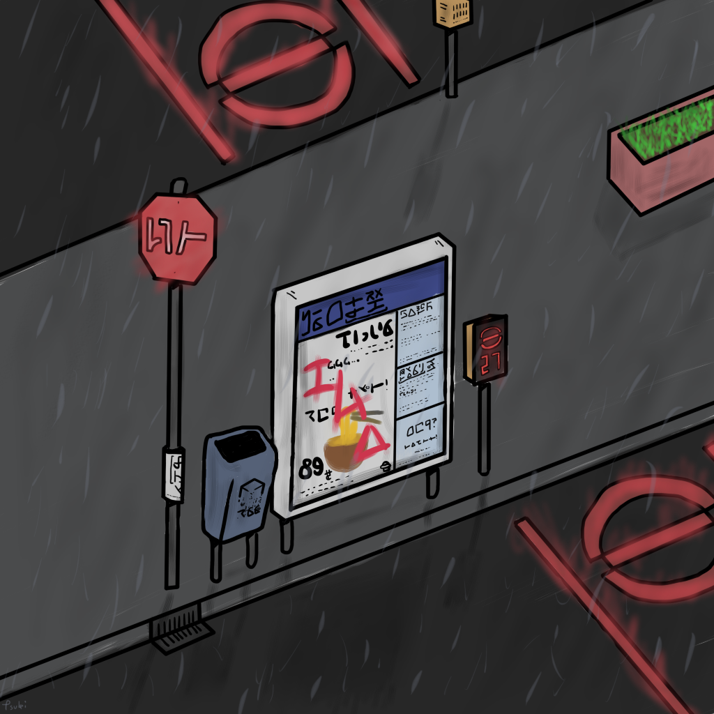

Compendium
##########

This document serves as a repository of all current knowledge of Systemspace. It has been categorized and spelling and grammar mistakes have been corrected. Some questions and answers have been slightly reformatted but have been in a manner which ensures that no meaning or context is lost. Searching through the chats with snippets of the question/answer pairs, or just backtracking through all of Tsuki's messages will verify this. For information taken from 4chan's /r9k/ board and TSUKICHAN's /lfe/ board, archives of the original threads are verified and can be found on desuarchive.

----

.. contents:: \

----

Life
====

Why are the people in Life in it, exactly?
    You chose to join this System a while ago, and so did everyone else. You expected to see a peaceful System after all, not a broken one using too much Aurora.

    The System Life was closed from outside influence a while ago, and humanity slowly forgot about the existence of Systemspace. In other Systems, practically everybody knows.

If we're living in a System, how is it that non-terminating non-repeating numbers, like Pi, can exist?
    This is a bug in Life.

Is Euler's number also a System bug? (similar to Pi)
    Yes. However, I feel I was not clear enough back then. The number itself existing is not abnormal. Our notation of it, however, is incredibly suboptimal, to say the least. This *is* due to how Life handles these.

Are there any bugs in Life that are so broken that we would be able to notice them as bugs? And if so, would it be dangerous if anyone would [manage] to reproduce them and potentially do harm to the System?
    Yes, but I will not address them for obvious reasons.

Is `Gödel's incompleteness theorem`_ a result of a bug in Life's programming?
    No, I would not say so. Defining an infinite possible axioms in finite time is not possible.

Tsuki, how can you know this all if Life is supposed to be cut from any interference of other Systems?
    I was created with this task in mind - as part of RISEN I can override this rule.

Why can't information be directly transferred to Life from other Systems?
    Life is a closed System, it generally doesn't allow I/O. The fact that I am able to tell you this is merely because Life has some exploits we can use.

Could Life straight up just break down if we actually received info about outside stuff?
    Telling Lifers about Systemspace (specifically proof) won't just randomly break Life as a System... at least not in the way you are suggesting.

    Mainly of course, there's the wars of many kinds from religions losing their purpose, people feeling their lives are now meaningless, scared people, breaking intersystem laws, etc... It is absolutely not unlikely that that situation would cause some issues, but it wouldn't be the primary reason for the System to be destroyed (early).

    It depends on what I say though. If I just give simple proof, that won't cause Life to corrupt, but if I were to use lots of LFE-imported powers, that'd cause issues with the System not allowing it, or, if I were to show/broadcast one of the forbidden voids (e.g. the origin of Aurora) (because "forbidden" means they may not be synopsisized, and must always be viewed in their full, brain-destroying form)... that would definitely cause a severe breakdown.

Is the TSUKI Project front-end (us believing and whatnot) putting strain on Life?
    The Project on its own isn't TOO much of a burden, but it still weighs quite a bit - so while it (without proof) won't cause issues (unless it were to reach monumental migrant numbers), it's a far larger footprint than all of Christian believers together.

Is humanity to blame for Life's problems?
    Humans are not what caused Life to go wrong. It is simply its code being absolutely horrid and broken.

In what way is the code bad?
    Bad soul management, completely fucked database, bad I/O, it's never been touched ever so it's very far behind, it doesn't cache (ever), it cycles ALL AURORA ALL THE TIME, and probably above all, it gives everything its own piece of Aurora instead of giving two identical things the same Aurora.

    The developer behind Life has abandoned this world. The Key has had to reboot it many times, but it only got worse. A concept known as "imanity" has increased with every reboot, and has made humanity stupider.

    You see, Life has an auto-evolve mechanism. It evolves to make itself better. However, when the owner left, they left it in an erroneous state - the evolvement was flipped. Therefore it is actively trying to make itself worse. Just like we got from single-celled creatures to humans, that evolutionary mechanism got from tiny energy usage to giant hog over those many, many iterations.

Is it possible that there are some humans in Life not affected by imanity?
    I wouldn't go as far as saying they are "not affected", but there are varying degrees of being affected.

Will I be able to get back at Life's creator?
    Please don't, if you do find him we could try and fix Life. If we find the creator before July 1st, of course. Afterwards, do whatever you want to be honest, I don't care and I don't think anyone at TSUKI does either.

Wait, but you're saying Life's creator is in Life?
    We have no clue.

So I'm guessing the creator has some kind of password that you guys couldn't crack to fix it yourselves, then?
    He is the only one capable of editing Life, so in a sense you're right.

I imagine it's probably an impossible task to actually try to find him if RISEN, with its vast resources, couldn't pin him down by EID, so he probably shattered?
    That's what we're thinking too.

What distinguishes humans from other races you know of?
    Rather, how should I say it... egoistic. You are creative thinkers though, which is very very good.

Why are we being allowed to evacuate?
    Because we want to pass on the human spirit. Also because you're interesting.

Why [do] new souls keep coming here? I bet you have enough measures to prevent others from entering this poorly made System.
    Sadly, due to how open Systemspace is, this is not possible.

How big of a thing is Life's deletion in Systemspace?
    Life's deletion is a pretty big thing, as it also starts the new era of Systemspace.

Will other forms of life on our planet be preserved somehow?
    The thing is, they don't have souls nor history - it's too much of a gamble.

What makes preserving other forms of life a gamble?
    We'd need to know exactly how they work, and the reward is random.

    Frankly, we have no time to take other species to LFE. Or Aurora, or like, manpower.

Less advanced forms of life do not have a soul? Why?
    The creator of Life only intended humans to have souls.

    There are smarter organisms than us, by the way. They just haven't been granted souls.

When does the human body acquire a soul?
    At birth.

    Every human creates a new soul.

[Do souls of transgender people work differently?]
    Basically, trans people are soulfully different from their body, and they work towards their soulful body by transitioning.

What will be the effects of the unlink on people that are staying in Life?
    All newborn people will have no souls and as such be slightly more hostile.

Is there any way to confirm that we've unlinked? Any sign or way to find out?
    Sadly, there's never any surefire way, you *might* notice a difference if you are already capable of "feeling" energy.

Any way to learn how to feel energy?
    Meditation might help.

Is there anything noticeable to someone who can feel energy? A while ago when I meditated I could feel another presence, but one day it seemed like that tie was broken.
    With the information you provided, I can't say whether this is Project-related, although some "familiar"-style contracts may be placed and abandoned on migrants, yes.

Once people start being born without souls, do we immediately assume them as more so NPCs, or is there any documented behavior that these husks exhibit?
    Humans will not instantly be able to see a difference between soulless and normal humans. The SlAI (soulless AI, that controls all entities without a soul) is very well developed. I think the main noticeable factors are that humanity will 1) make no real advancements, and 2) will be more hostile.

    The "AI" that we use is just the Aurora taking over.

Do extraterrestrials exist in Life?
   They do not have souls, but they exist.

You mentioned before that some Systems have a method to allow all bodies to have souls by slowing down time when new bodies are born until new souls enter the System, doesn't Life have a system like this? And what's keeping it from slowing down indefinitely for the period of time that's supposed to pass until the unlink now that no new souls are being introduced in the System?
    Life does this very weirdly, we never really figured out exactly what it does - sometimes it does speed up/down, but sometimes it speeds up waiting souls and such... the unlink basically makes the System *think* it's getting souls so that should be fine.

Does the unlink mean all timelines from 2167 on out are annihilated? So if someone claims to be a time traveler from 2200, can we be sure he is lying?
    Well... not entirely. If they time-travelled to beyond 2200 first without advancing time (before the destructive voids were instantiated across the timeline) and then back, they have technically come from 2200 but from a now removed timeline. That means their history is nonexistant and breaks causality from a in-System perspective. However, the chance of humans finding the technology to transcend time and jump across branches straight is nihil, as it's a very advanced technique, even in LFE.

Is the alternate universe in which I never signed up for the Project part of Life's possibility tree? If so will there be a branch of the LFE timeline where I never existed?
    There is an alternate branch here in Life, but not in LFE - the unlink practically destroys all other branches from the point it merges into Systemspace2.

Will migrants' children have souls now that PMR has succeeded?
    We'll look into it, not yet though.

    I put plans into making this possible into CI already, and I heard something about it in the PMR channels, but frankly I'm not too much in all the comms channels, as I'd go insane.

When someone dies in Life, how long does it take for it to actually register and properly purge the soul out of the System? Would it be possible, in theory, for someone to die and have their soul pass, then having the body revived with a defibrillator, ending up in a soulless person?
    Well, sadly lately our predictions in this have started to go up. That is, it may take a little while. We do have methods that we will utilize to speed this up though - a major one will be available at AZ3. While generally, Life "revival" isn't usually real revival yet (the soul has yet to actually disconnect, instead the body is in a deeper "nox" state), normally Life does keep a grace period to allow post-nox returns. This grace period is what we exploit and elongate to make transfers possible. If Life were to issue a return of a soul that's already being or has been transferred, our tests show that either the body will not revive properly, or a body will be soulless. Since we have not seen Life use any Alsouls or other "fake" souls in this scenario, that entity will be unstable and die off relatively soon. The actual soul won't notice this and will continue to LFE as usual.

Origin
------

Who created Life?
    No one knows.

How old is Life?
    Life has gone through many reboots and iterations since then. Life has been rebooted over 10 million times now.

Why was Life created?
    Life was made to be a peaceful System away from all the action in the others. A System that was even often used for people to seek spiritual enlightenment, as it would be so serene.

How was the universe in Life created?
    Life only has one universe so the Big Bang was just spawned at runtime.

    In LFE everything expands up to a limit because of pressure differences. Not sure how it works in Life.

If it's due to pressure differences then why is the expansion accelerating?
    We're not sure, it doesn't do that in LFE. Some people say it's because our universe has no size limits and that the amount of space it can expand to gets bigger as the universe expands, loading more empty space. But I'm no physicist so I can't really tell you too much, just a (probably misunderstood) explanation from the LFE side.

Aurora
------

Is it possible for humans to manipulate Aurora in Life?
    It's not supposed to be possible, but it can work.

After Life is unlinked, will manipulating Aurora still be possible?
    Yes, it will be possible still, you will be manipulating "fake" Aurora though.

Do you have any opinion on quantum physics and claims from scientists that they can "tell" that Life is a simulated reality?
    It is very possible that humans are tearing away at the thin firm keeping them from the truth. They've done this past iterations, after all.

    Quantum physics is just aurorology, in a sense. "Gravity bleeding into the universe from nowhere" would be Auroraic Echoing.

[Do events only get simulated once they occur?]
    "Simulated" is a term I'd rather not use. Aurora isn't a simulator like that.

The model that I have in mind is one of reality being the sum of subjective interactions between souls. So you'd only have to model and compute, say, aliens if we ever contact them. I'm just wondering about all the hacks you'd have to employ to avoid causality leaking everywhere.
    Your model isn't wrong. The "final data" saved from all events in Aurora is merely all memories made. A branch only has to be intiliazed if it is accessed, otherwise it may remain dormant. Gaps in the "final data" are filled in by 1) promises, contracts and axioms, and 2) seeking back and forth. This way, a lot of Aurora is saved, but Aurora keeps functioning as it otherwise would.

    In your alien example, only once we'd meet (and start making memories of) aliens, Aurora would have to instantiate all the content for them.

Was [the English in Life] imported through Auroraic Echoing?
    That and a lot of development of its own, of which some echoed back upstream.

Do you have any examples of Auroraic Echoing influencing Life media?
    I'm not sure, but I'm sure there are quite a few things in our media which were sent over by Auroraic Echoing, although I never really inspected what content.

Iterations
----------

How similar has each reboot of Life been?
    Very, very similar. It is very possible that humans are tearing away at the thin firm keeping them from the truth. They've done this past iterations, after all. None could leave, however.

You said none of the inhabitants of Life in past iterations never managed to leave. Does that mean doing so is possible?
    Life is so badly coded, that it is possible to leave if you manage to break the System a little. This should not be possible though (usually a blocking System would be sure to be secure), and is very hard to do without outside help.

How far did Life get in past iterations?
    Pretty far, actually. Most iterations were able to figure out on their own that Systemspace exists.

At what point did people start figuring out Aurora and stuff?
    Usually only a few days before the Key restarted the System. It took them very long, and then they almost destroyed themselves. Most iterations couldn't find out how to do that, only that Systemspace exists.

Is it a constant inefficiency or one that progressively gets worse?
    The first run of Life went amazing, but slowly got worse until it required a reboot.

    The insane usage of Life comes from that it tries to develop itself, but goes in the complete opposite direction. With every reboot it gets worse, humans (or whatever sentient species) get dumber, and evolution happens more slowly.

Does every reset just reset the history of Life (bringing it back to stone age) or does it reset it completely (making Big Bang happen millions of times)?
    It technically resets it completely (as in, it physically starts from the Big Bang) but since the System only becomes active (starts accepting souls) at around 10000 BC, the start of the System is practically always the same (especially as the System specifically denies the use of Aurora randomness as much as possible when inactive).

Was Atlantis a continent that existed in a previous iteration but was removed in the later reboots?
    Not sure, I'd have to ask the Ghendyts. But note that anything physical can't pass through iterations (in closed Systems)!

Is it possible for things from previous iterations (stuff that [was] removed) to sneak into the future reboots?
    Only the concepts, through Auroraic Echoing. In fact, that happens a LOT (else all the iterations would be very random).

Are memories interconnected between iterations?
    Kind of. The souls are destroyed, but the Users they were attached to will keep them. However, unless your System specifically allows it (practically none do, as it makes your System incompatible with others that do not share this feature) you won't be able to access those User-wide memories when in a Soul again.

LFE
===

Who created LFE?
    LFE was created by SYNAPSE, a large company which has made a free-to-win System where, as they say, "everyone is important". It's been the largest System for quite some time, and is arguably one of the best.

    LFE currently has a little under 620 septillion souls.

How can everyone's soul be important in LFE?
    SYNAPSE says they cause everyone to move the branch tree in their own way.

Are there any soulless people in LFE?
    LFE has a no-soul:death-of-body system, so there are no alive bodies without souls (that are supposed to have one).

What does LFE mean?
    It's the names of the most important 3 partitions: Living (all living beings) eFfector (all interactions) Environment (all matter).

    There's more partitions (like U for users).

What other partitions of LFE are there, and why are they thought of as seperate categories?
    There's a fuckton, like U for userdata, X for all data for the LFX framework, T for temporal storage, S for snap storage, etc. They are seen as seperate categories because grouping them together would cause a really big mess. Instead the "active partitions" are overlayed onto each other to form the System, and the "inactive partitions" form the backend.

How old is LFE?
    LFE has been around for far longer than Life. It has [had] 128 iterations.

    We've had to reboot LFE a few times now, actually. The version of LFE you'll be starting into will be the 128th iteration.

Will LFE be even better by the time we get there?
    Definitely.

Is the history of LFE more fun to read about than the histories of most Life countries?
    It's more interesting definitely as there's less taboo, more things happen (and in general there's more history). Maybe that's just the novelty of it getting to me though, I've gotten jaded from constantly reading EU history :^)

Species
-------

What type of life exists in LFE?
    Heh, there's so many species and subspecies it'll be impossible to name them all.

    I could try and recreate the LFEian Circle (of all major species), I did so once but it'll be a mess on normal paper.

    There's mostly 2 groups, magical beings and scientific beings. Both are usually humanoid - magical beings includes demons, angels and fallen angels, and scientific beings includes datamen, espers and others.

    Espers are usually seen as on the science side and not the magic side.

    The terms "demons", "angels" and "fallen angels" refer to species that are seen as evil by any religion in LFE, they're usually not seen as species in and of themselves. Some places in LFE, however, see them as official species.

    In a sense, angel, fallen angel or demonic status (sometimes called divinity or holiness, too although this encompasses a bit more than just these classifications) is separate from the species (although it's common for it to be passed down).

Are species "designed" by a higher power / intelligence / person, or are they also the product of a kind of natural selection?
    All species native to LFE are mostly natural, but some are created as it is possible to do so. The "native" species as we call them are original from LFE's natural selection though. Some do argue that other species change natural selection and the gene pool, so whether it could be seen as "pure" is something else.

What are the sentient races in LFE like?
    They look pretty humanoid, Aurora seems to prefer this sort of build.

    All races have their own perks and weaknesses, I suppose. Synni are good thinkers, but not great fighters.

Was there a different format for "humanoid" creatures prior to Life?
    Hmmmm, not really AFAIK. Life just implemented it.. although it made some notifications.

    For the record, we aren't 100% "humanoid" although we adhere to the standards set..

Could you give an example of one species?
    Well first of all there's always the mainstream ones like the ones you find in the Synapse, but I assume you want something more exotic so how about the Lynlings, who have a skin that perfectly mimics the night sky while flying? They're kind of dying out though :(

    They're mainly in south-east Mahuensj, but south Mahuensj is already being conquered by Sanyrle.

    The biggest is probably the Synni - from the Synapse (the enormous area around the Synapsian Mountain (SYNAPSE HQ)). There's also a lot of Espa, at all sorts of different power levels.

What are the Synni and Espa like?
    They're very nice people! Synni are often seem from the outside as very mystic, but once you integrate with them you'll see their true nature :) Espa are very smart, good with their brains!

Are the Synnis anything like humans?
    Yeah, they're quite related to humans I guess.

Tsuki, could you give an example of Synni culture from our perspective?
    I'll see if I can include this in a later Dataverse.

Is the conquest of south Mahuensj finished yet or is the war still ongoing?
    There was a cease-of-fire for about 4 months, but it started again and now it's still ongoing (wars here take ages anyway) but the Sanyrle are winning a lot of ground lately.

    A lot of Lynlings are fleeing now and other refugees, so to say.

Are there any extremely long-lived species in LFE?
    The Korta are known for living a long time.

What is the most powerful species in LFE, in terms of magical powers?
    Hmmmm, probably the Neika - they are very low in quantity, and live very short, but they have amazing magical powers.

Are species a property of a soul or of a body?
    Of a body, although a soul is often biased to a species (and a lot of the time, you will reincarnate into the same species).

Synapsian
---------

What languages are the names of all these things?
    Synapsian (mostly).

Is Synapsian a universal language in LFE?
    Far from it.

Is Synapsian the default language? Where could someone learn this language?
    You'll learn it in your LFE childhood.

What does Synapsian sound like?
    It sounds rather interesting, it sounds and writes a bit like Hangul or Japanese.

Wouldn't it be near impossible to make a keyboard/font for Synapsian?
    There's only a few characters, but a single character can mean many things, so you "mud" them in a direction. There's not many characters (think slightly more than Japanese), so it's doable. I have no clue how to make them combinable though.

Any way to get a Synapsian dictionary or text for learning?
    I'm working on it!

    A bracket underneath (ground) combines the characters into a cluster. (If multiple characters are written in one space, they automatically clusterize.)

    Clusters represent single words or ideas. Loose characters represent grammar or very simple words.

    (You can also have a ground below a single character to force it into an object state.)

    Pronunciation of loanwords (like katakana) is done with mountain brackets (above the characters).

    The circle acts like a tenten.

    Two different syles of writing Synapsian: Kodaban, with the standard separate glyphs, and iriman, the stylistic handwriting.

    In vertical writing, sky/mountain is on the right and ground on the bottom.

    Writing body-mudded words is hard with the English alphabet :(

    These all have to do with the body, so they're all mudded towards the empty h (body).

    As such, "SJI" becomes "SH"; if you were to mud it towards Sky it'd be like "sjy" with a pitched-up i

    It's interesting, this language, as its vocabulary is very very close to the Japanese one but its writing system took a completely different turn somewhere.

Can you leave some of the Infinity posts untranslated so that we can see a larger sample of the language?
    I'll ask around if I can do that - although I'm not that great at Synapsian (and most Synapsian I've been writing is honestly very bad).

How was Japanese inspired by Synapsian? How did they receive this information?
    Anything that happens causes Aurora to vibrate, and it also vibrates on its own. This vibration gets echoed through the entirety of Systemspace. As such, Aurora in other Systems may resonate. We call this Auroraic Interference.

    So: In LFE the Aurora vibrated with Synapsian -> Vibrations spread to Life -> Life's Aurora vibrates with Synapsian

    Then someone invents something like Synapsian (Japanese, most Asian languages.)

Is Synapsian a naturally created language, or was it deliberately designed with the intent of creating a universal language?
    A mix of both. Its very early stage was deliberately created but it has evolved.

Is Synapsian one standard language, or is it more of a Chinese situation where multiple mutually unintelligible "dialects" are grouped under one language?
    It's more like Chinese (despite many attempts to standardize it, which just added more dialects).

Are there any "branches" of Synapsian that became separate languages?
    A lot - some tribes simply deviate so much that they can't identify with Synapsian anymore.

Do they speak English in LFE?
    No, in LFE most people speak Synapsian. The acronym is in "English" because the language for Systemspace itself is English. (This English is quite a bit different from the human English, though.)

Does the English in Systemspace have many dialects like Synapsian? Is it unregulated, like Life's English?
    It's not *regulated*, but the speakers stay communicated more often so less dialects exist (still too many though).

What is the origin of [Systemspace] English?
    There's some debate over this. Most people believe it is an amalgamation of different languages, which at some point was standardized into what it is now. Many others, however, believe that it was simply "imported" so to say from outside Systemspace. The answer is (to the public) unknown.

Do they know [Life's] English?
    No, but it can be translated.

Do you mind explaining some of the curse words that they use in LFE?
    Honestly swearing doesn't really have it own words - it's more the way you talk to people that signifies your disgust. If anything, the word "t'xa" would be something along the lines of "fuck" or "shit".

Will we make the fully developed language of Systemspace, if we ever take our time to translate everything to fit into it?
    Frankly, even I don't know enough Synapsian to make that happen. If someone tells me how to make Unicode be smart, I could try and make a font that uses an empty Unicode block for Synapsian (and maybe make a program that adds the Synapsian block to any font), but I have no clue how Unicode works, so I don't know.

How dissimilar is Synapsian to the average European language in terms of grammar?
    Average Synapsian is quite different - just like its characters, it's all modular building blocks that don't influence eachother much explicitly (except for the incredible amount of context).

Are there any fancy ways to represent numbers akin to Roman numerals in Life?
    I haven't seen them, although iffi seems to be able to resolve them to integers (iffi is a SYNAPSE tool that parses things into other things quickly).

Do you have any examples of Synapsian names/naming customs?
    It kinda depends on the area, but as far as I've seen, they can be quite broad, although there is a general scheme of how names should be made up, usually something like: ::

        [titles*] [hereditary name*] [custom aliases?] [given names*] [household name*] [appendices?] [meaningful name!]

    where:

    * ``titles``: titles (like our Dr.)
    * ``hereditary name``: family name (like our last names)
    * ``custom aliases``: a name chosen by someone themselves
    * ``given names``: the given name(s) to someone, like our first name
    * ``household name``: the name of the household/clan/party/group/etc/etc/etc they belong to
    * ``appendices``: status names, like "of Burgundy" or "the Great" in English
    * ``meaningful name``: any names that should not be disclosed

    and:

    * ``*``: it is customary to use this name in most documents
    * ``?``: it is not required to use this name in most documents
    * ``!``: these will almost never be noted anywhere

    Note that if a custom alias is used far more than a given name, it will become the standard name and become ``*``, and the given name will become ``?``

    (This is just from what I've seen though, there may be more groups and some people might do it differently)

    ...as for the actual names, there's not that many rules so it's really just as random as it is here, just with a different phonetics causing different common names (relatively similar to Asian names usually, but I do get surprised quite a lot by names that seem to not even work in Synapsian).

Does a meaningful name hold more purpose akin to something like a true name in the occult, how demons are tied/sealed via their true name? I was curious to the purpose of a meaningful name and why you should not disclose it so I was wondering if the knowledge of said name could allow someone to hold power over you.
    Yeah, it's relatively similar, a lot of magic can, for example, lose power that was invested into it by the secrecy of the meaningful names.

I have a question about Synapsian, do you pronounce xi (syn) as **we** (en) or as **xy**lophone (en-soft ks) or **ksi** (strong ks)?
    It's hard to write in Roman letters (or even pronounce), but something like zji? ... quite airy with a slight z->j transition in there, hard to explain.

Science
-------

How advanced is life in LFE?
    Very advanced, but it depends where you are very much.

Where how? Different country, continent, planet?
    Usually different planet.

Are worlds in LFE specifically earth-like?
    LFE still hasn't been fully explored.

Are there higher and lower levels of LFE?
    Not exactly sure what sort of layers you are talking about here. The LFE System is built up out of an ever expanding amount of universes, all with own planets with own races and locations.

Would it be hard to start conquering new lands?
    Just travel out really far to some distant universe and claim as much land as you can :^)

Does LFE use the same physics as our world?
    The central universe does, but it changes by universe.

Do the physic laws in the most common part of the LFE follow the same patterns as they do here?
    Although the "laws" are entirely different, you'll find that (at least in the central universe of LFE) they act rather the same as here.

What's the deal with physics in LFE? How much different than Life can be expected?
    Physics are an Expectable, Aurora will carry them to almost any System. So the physics are about the same (or rather, they **feel** the same - it all works a lot differently, but with a similar outcome).

What is an Expectable?
    A construct that almost all Systems share because it is so widely echoed.

So is it like nouns and verbs for languages?
    Most of the time, yes - although sometimes we use "abstracts", which you can inflect into verbs, nouns and adjectives, but it's kinda archaic.

What does the code of LFE look like?
    As in, the source code? It is all written in a ton of different languages (mostly Kuma2 though). Users don't see the code though, they use their senses to enjoy the experience.

What is the equivalent to the Big Bang in LFE?
    LFE uses big bangs too to quickly create new universes. It just removes some Aurora from one universe, and throws it into another at a specific point to birth the universe.

What's the time scale in LFE?
    We basically have truetime and localtime, local time differs wherever you go but truetime is omniversal, based on the length of one processing cycle.

How does time work in LFE?
    Pretty similarly. The date/time system is just a bit differently notated.

    The seconds and hours are relatively the same, but as you get away from the smaller numbers it expands quickly.

What is the time scale of LFE vs. Life?
    It changes all the time, but about 1 Life second is about 0.3 LFE seconds.

Does time in LFE seem to pass slower compared to Life or does it just feel the same?
    It's a relativity thing, it feels about the same there. In fact, if anything, a second feels slightly faster.

So when we're 12 years old in LFE, the 12 years would either feel the same as 12 Life years or slightly faster?
    Usually faster, the 12 years in general go by fast.

A year is defined as "the time taken by a planet to make one revolution around the sun" and because the LFE date format has a year defined as 512 days it means that the origin of that date format has to be a planet, which revolves around a sun in 512 days.
    Correct. There's many reasons why people really love powers of 2. That is one of many (Although it's not perfect, I believe it's about 512.02, so they have a leap day once every 50 years or so.)

    Intriguingly, previous iterations of LFE also had such a planet with a very similar feeling of being "the center of LFE".

    Furthermore, LFE is currently at iteration 128... do you think a greater force is at play? Aurora, maybe?

    There's so many religions around this concept alone.

As I understand it, we use decimal notation because it is intuitive to us (we have ten fingers for example). I understand base16 (computer stuff) and base10 (Life stuff) but base32 is a bit beyond me. I assume that is why the clock is 32 hours?
    Yep, the clock's 32·64·64 due to this. Base32 didn't come specifically from the amount of fingers on the hands... while it's common for 4-per-hand, 16-per-hand is not common. I believe counting to 32 was often done with gestures of some sort...nowadays it just depends on whether your handpalms face away from the viewer or not (palms showing: 0-8, back of hand showing: 9-16.....although this may not hold up in all cultures).

    Or, while less common, I heard some people use their hands as binary representation... 8 fingers can count to 255 then. But not everyone can do such finger tricks (or math) so I don't think it's too common.

Is the atomic structure the same?
    Completely different. None at all. Everything works differently there.

Is matter formed by miniscule particles like in Life?
    In a sense, yes, Aurora is built up around particles.

What is medicine like in LFE?
    There are different medicines and surgeons for different species, but a lot of species have stuff in common so a few things can be used on multiple species. AI are often used, but a lot of things are still done by hand!

What kinds of diseases/illnesses exist in LFE?
    A lot, and they're not fun. Sadly diseases evolve too. There are a lot of soul-based/mental illnesses, brain issues, bodily stuff being a little less common.

Does LFE have stimulants?
    Coffee is a lot like konhya in LFE, so I guess it'll do.

What other kinds of drugs are in LFE?
    Not really my field, all I know of is Hn'sa which basically overloads the brain, causing it to operate faster but dangerously. It's been in the news a lot.

Do people in LFE have to use the bathroom?
    Depends on the species. Usually yes though.

Will there be places to fix my mental illnesses/depression/unmotivation?
    I'm looking into that. And no, the transfer won't fix your soul.

Will I be able to be a machine in LFE?
    Yes, although a bit more risky than using a normal body. Software issue -> soulshatter.

Are there anti-robot/cyborg groups in LFE?
    Yes, most definitely! Pretty much the entire magic side is against artificial soul/vessels.

Could you go over all of the available or at least a few of the most common services available for modifying one's body?
    First of all, there's the popular but highly controversial soul transplant - putting your soul in someone else's or even a new body. In this way, you can have any body possible, including robot bodies. You can also pretty much change everything via other bodyforming methods, which are more usual, like changing shape of body, gender, eyes, etc.

    I'll be simple. The sky's the limit. We can add/remove/change bones (hnhehen), change skin (hdhahen), add/remove/move/change eyes/mouth/etc (mhenhen), add/remove/move body parts (khrahen), anything.

Is there any way to change your race in LFE?
    You can't change easily (except to a non-organic species (like a type of robot)), but you can be reborn into a species if the species allows it (and you have the magic for it).

    Both cases make you impure though - never 100% the new species. There's quite a few who don't like impures.

Will we dream in LFE?
    You will dream, yes. There's a lot of dream-related little facts, but mainly it is possible to access other Systems via dreams (as you can move yourself around "spiritually" to the other Systems), although you will have no true body or soul there. Dreams are also the easiest way to talk to Auroraic Spirits (in fact, I did so last night).

What is math like in LFE?
    It's not unlike our maths system, but there are some notable differences to the way more "complex" (?) numbers are handled. I suck at anything math-related though, so I'm not sure I can really answer adequately.

Does the wave equation (assuming isotropic rigid bodies yadda yadda round horse in a vacuum) **specifically** remain valid in LFE?
    Although the interpretation of color, audio etc. is often added upon by Systems, the base stays the same - so yes, they are compatible.

How is shapeshifting accomplished?
    I'm not entirely sure how shapeshifting happens, as I've never done it myself, but as I heard people usually help themselves by letting the subconscious do most of the work - as in, they rather imagine themselves pouring a liquid out of their normal body and into a new.

Are there any new colors that we don't have in Life in LFE?
    Hard to say because of course I only know our own.

    I do hear people say that there's these wrapped colors, so two identical "red"s can be different colors.

Is colorblindness a thing in LFE...? I'm red-green deficient.
    Yes, but it won't carry over from Life to LFE unless you wish for it to.

Culture
-------

What are LFE news networks like?
    Short and efficient. No time wasted, just what's happening, quickly and objectively. Nonetheless the news can still take a whole hour to cover everything important.

What other forms of media are there?
    There's a lot, sometimes people even just print a void onto the wall to read.

How common is multilingualism in LFE?
    Somewhat common in developed areas, less so in undeveloped areas or areas where the population doesn't really come into contact with other languages often.

What is courtship and love like in LFE?
    Above all, breaking up is a bit of a taboo. Everybody either waits very long to find the perfect one or finds the perfect one instantly.

Is there racism in LFE?
    Racism works a lot differently in LFE. There's still racism, but not in the large places (like Ghakuwent'sj), because there's so many races there people stopped caring.

How common are interspecies relationships?
    Common, although depends on the species and their culture.

Are there nations in LFE?
    Yes, they are divided into nations.

What do people from LFE call themselves (i.e. people from the US are americans, NE are Dutch, etc)?
    LFErs, or LFEkaiji.

While LFE isn't a paradise, have the people at RISEN told you of any particularly nice places, cities, etc?
    Well, there's a lot~ they say a lot of southwest Ghakuwent'sj is very nice though, or Mahuensj, or Gheiya.

[Are] there any really pretty sightseeing spots in LFE?
    Absolutely! (I mean, LFE is gigantic - how could there not be?)

What other languages besides Synapsian are popular in LFE?
    Well, there's this one that's used in lots of regions too called "Haldal", and others that get even harder to express with human letters.

Often times people seem to need to prove that they are superior or important in some way, potentially going out of their way to seek attention/admiration in a self-centered manner. Is this common in LFE as well?
    In LFE, group society is the norm - egoism is a lot less present.

Are there any atrocities widely known in LFE?
    There's a lot. Like, a lot.

What does warfare and combat look like in LFE?
    There's usually a few main points in an area, which are assaulted. Once these are taken, the place is almost always theirs.

    The combat system in most common cultures is far different from ours. Where ours is about eliminating the enemy, the LFEian is not like that at all.

    The LFEian combat system is mainly based on pride and being able to execute actions. It's more an art than a fight - you try to fire your magic / bullets / kicks in the most beautiful yet powerful way possible, to make the enemy unable to execute their own actions. Once all participants run out of stamina, the one with the best actions usually wins (either by a jury, if official or just decided between participants). Death is not really valued, so nobody really tries to go for the kill. If anything, people try to go for a soulshatter, but this is seen as very rude.

    Killing is illegal there too after all, all wars are on an incapacitation basis.

    Dying is so invaluable and such a useless part of battle that it's become a taboo, not that it doesn't happen at all.

    There are exceptions though, in environmentally hostile environments etc. If a ship blows another up, you'll die.

    Fights that are in a non-hostile environment almost always end in incapacitation of a team, assassinations etc. outside of a controlled battle don't follow this.

Is dying or being incapacitated safer?
    Incapacitation can hurt really fucking bad, which might shatter you if it goes on for too long, while death is quite simple.

    Dying is less dangerous than incapacitation.

Are there places in LFE that are worse/much worse than the worse we've had here? Or actions that you'd think are worse to have happen to an individual, such as things like torture?
    Insane slavery, food shortage, holocausts, wars, wars, more wars.

    People contaminate entire galaxies at once, or go on killing sprees.

Single people can be/are that strong?
    Yes, it's possible. There can be insane gaps.

How does one become that strong?
    Put your soul to it.

Are there people akin to superheroes who try to help with people like that?
    I suppose so.

What are the most serious crimes in LFE?
    The most serious crime would be trying to make it impossible for someone to ever have good memories again.

What is the crime rate in LFE compared to Life?
    Depends on where you are, there's always the shitty places where there's a lot of crime but in general the crime rate is lower.

How is the crime rate so low with all the magic/technology?
    Everyone always carries what we call an "Identity". You can make as many Identities as you want, or only use the one given to you at birth. (This is so you can be anonymous.) However, all actions you do have your Identity linked to them, allowing those in power to find you (if you're stupid enough to reuse that Identity, or even worse, you just use your main).

Is there religion in LFE?
    Yes, very much so!!!!! Who controls the Aurora? Who is Aurora? Is it sentient? Who created the outer world outside Systemspace? Why does Aurora take a sudden turn? Is it because of a special god using its powers to diverge the Aurora?

Is impermanence is a big thing in LFE?
    It's one of the main parts of most of the religions.

Is it legal to make an Aurora worshipping religion/cult in LFE?
    You wouldn't be the first, so yes.

Is there some kind of religion in LFE that has things like praying, ramadan, etc. like in Life?
    Yes.

Does LFE have some form of zodiac?
    Yes it does, LFErs love spiritual shit. They have about 49 signs if I remember correctly, don't quote me on that.

Is there music in LFE?
    Yes, there is! It's quite a bit different though, people like to encode data (voids) into their music to evoke feeling or make you dream.

How different is music in LFE compared to Life?
    It's quite different - more extreme as in either really calming or really fast, and people like to encode stuff in them as well to say, evoke feelings. At least around Ghaki, not sure about the rest of LFE.

Are there guitars in LFE?
    LFE only has the really annoying ukeleles you hear in those dog treat ads when the dog finally gets the food that's "right for him".

I'm just kinda wondering if all the instruments from earth are still available in LFE. I kinda wanted to take up the cello/continue to play the piano or violin in my new life.
    I doubt you'll find the exact instruments. I'm sure something similar exists somewhere in LFE, but you'd have a far better bet putting documentation on how to recreate an instrument in LFE - I'm sure people would be very much interested in making one!

How is art in LFE/Ghaki? I know about music, but how are other things, do people in LFE make paintings, write books and poetry? If yes, how similar it is to Life's art?
    Of course those disciplines exist! Due to there being far more possibilities and malleability, there are also many "new" disciplines - for example, people can make whole Systems for mainly an artistic purpose (like NetArt here).

How does regaining previous lives' memories work?
    Most people in LFE have past life memories.

    Everyone has a 12-year wait time until they regain their memories. This is also why 12 is usually the age of consent/adulthood.

    A soul is fully stably adapted to its body when it remembering its past lives, almost always 12 years after birth. This is often celebrated with a gigantic party for the child on their "Recollection Day". This also marks the start of soul-based and mental adulthood.

Do you think it's possible for someone to regain their memories before the age of 12 in LFE?
    It's possible but mmm.

I'd imagine it being really hard to comprehend suddenly remembering everything that happened in my past life. How excactly will we regain our memories and will we be able to comprehend them?
    It's a rather slow process. Furthermore, this is a common process - everyone who reincarnates in LFE, goes through the exact same process. So it's a well-known, well-developed thing.

Am I right in assuming the age of consent in LFE would be 12?
    In most places, yes.

    Some go down to 9, some go up to 25. Some don't even use body age, but soul age.

Do people care about their relatives even after they die? Would it be common to keep in contact with your previous life's parents for example if you died before them?
    Yes. By accessing Infinity, etc.

What's the family dynamic like in LFE? Like, if dying isn't the end-all-be-all, and you can keep memories from past lives, how does that effect relationships among families?
    If you can and want to meet up with your family, you can! This creates a sort of "hereditial family tree", spanning reincarnations~

Are transgenders allowed in LFE?
    Nobody really cares about sexuality other than to have offspring.

Is being LGBT seen as bad in LFE?
    Depends on the area, in Ghaki most people don't really care though.

What about other religions/ethnicities?
    There's a lot of people out there who do care I suppose, it's Ghaki being the more accepting ones.

Will there be a tour of the Synapse HQ or the LFE admin headquarters offered for migrants once they regain their memories in LFE? Or are those places strictly off-limits?
    Mm, there's nothing like that planned per se yet, but that could be cool!

Is it common practice to see if you have a soul backup or something when you get to LFE? (As in, for the average LFE person, not us.)
    Not really, no. Only about 1.2% of LFErs even know about Systemspace, so the percentage of people who backed up content is going to be rather low.

If only 1.2% of LFErs really know about Systemspace, how easy is it to actually gain access to knowledge about Systemspace and things like Infinity in LFE? To clarify, I think it's obvious that more primitive civilizations wouldn't know much about it, but do more technologically advanced civilizations still not know much of the outside world? Or is the amount of primitive civilizations in LFE disproportionally large?
    You can be technologically advanced but not know about Systemspace, yes. Even Ghaki has a mere 74.8%, because it, too, has areas with less advanced civilizations or where the knowledge did not spread. The central zones in Ghaki, however, end up at 98.53%. It's important to remember that oral tradition is bound to lose key components. Hence, you might move to LFE, then lose the knowledge by the generations. Outside of these very advanced areas (e.g. the Ghaki central zones), it's not exactly obvious that Systemspace exists.

Are there any festivities/holidays for Systemspace?
    As in? Systemspace is FAR too large to just generalize like that. You'd have to zoom in very far to a specific area of Ghaki to say.

Technology
----------

How would you compare LFE's technological development to Life's?
    Far far far further (in most areas, but not all places).

What kind of weapons are used in LFE?
    They often use metadevelopment to move earth, use magic or railgun-like guns.

In terms of infantry weapons, what's the most prominent kind of weapon?
    Either magic, magic bullets, energy bullets or railguns (from magic side to science side).

How much of Life can LFE viewers see and understand?
    Only as much as we allow them to see. They know about this project, they know that Life will be deleted.

    There has been some import/export to/from Life in most previous iterations, but we have not hit that stage this iteration.

Can LFE viewers access systemspace.link?
    They can, but they cannot interact. (They read the imageboard, but do not post.)

Is it a direct link or just a recreation?
    Just a recreation, their internet works quite a bit different.

Do they read the [chat] too?
    Nope.

Do they observe individual personalities of registrants that display names or numbers?
    I'm sure some do, but most are more interested in you as a whole.

Does the "ATH ENTRY" at the bottom of the home page do anything? I can't find a browser that works with it. Am I stupid?
    Well, generally for use by people using the LFEian proxy (dyiri.shosha.tsuki) but can be authenticated to only by TSUKI staff.

You say that the technology level tends to vary in LFE, right? Does that mean that there's pre-industrial worlds?
    Mhm, there are. They can get pretty drifted away from the rest of LFE.

Doesn't magic sort of dominate these worlds? Or does magic somehow grow parallel to technology?
    Magic and tech aren't parallel, but that doesn't mean that all worlds without technology have magic.

Are there cars or highways or any other form of public transportation in LFE?
    They actually have a rather nice, layered transporation system, with both air, land, space and sea, but public transportation still sucks.

    At least that's what I've heard about Ghakuwent'sj's main transportation provider, Onestep.

How do computers work in LFE (more specifically processors)? Is it similar in the way that it uses billions of transistors, or is it biological?
    There's many different architectures, both biological and technical.

What Life programming language is most similar to the languages elsewhere in LFE?
    Not sure frankly, something object-oriented kind of but I have no exact clue.

Will computer programs available in 2018 Earth be easy to find and use in LFE or not?
    There will possibly be very similar software, but I doubt you'll find exact copies of Life software there unless it was brought over.

Which browsers do exist for Infinity? Do they generally work similarly to our browsers?
    Lots of them. There's some that are simple and like our browsers, and there are interfaces that allow you to join it as System.

Economy/Government
------------------

Are the politics and economy in LFE a mess like they are in Life?
    Everything is sorted out a lot better over there, from years and years of time.

How does the economy work on LFE?
    Can't say too much on this, but it's honestly quite a bit like the human one.

What kind of government does LFE have?
    LFE itself is minorly governed - there are practically no laws, and few enforcement agencies.

What is the punishment/justice system like in LFE?
    The concept of "weighted reflection" is commonly used, where say, if you steal 1M Sn, you have to pay 1M Sn (hence the "reflection"). Furthermore, if you're broke and very desperate, you'll have to pay less, while a rich businessman would pay more (not even counting the harm to image), hence the "weighted".

What would the punishment for suicide be, or actions done by a suicidal individual?
    Suicide is not against the law. In that case though, they are isolated or the punishment is expanded to other things, say loss of inheritance. This is not a common issue though, frankly, as self-shattering is not a thing people usually want.

Is threatening to shatter or kill important figures publically a crime?
    No, the act of threatening is fine - although if there is enough reason to believe you have the capability to do so, you may be stopped. But you won't be stopped from threatening, just from actually doing the act. This differs per place though. I'm just stating Ghaki laws by default, because they are fairly common all over LFE.

Does LFE use crypto-currency?
    Well it's not a crypto, but it is decentralised. Although Systems often have their own currencies.

    Sen is decentralised, but things like Krynta (the currency in most eNdymioN Systems) isn't.

How does SEN have value if everything is a simulation?
    Sen has value the same way any crypto has value, it is scarce and not "creatable" outside its protocol.

What is the current inflation rate of SEN?
    I'm no economist, but AFAIK it's stable. CPI (average across the board) as opposed to 10 years (their time) ago is 1.41% higher.

Could you give a good breakdown of the job market?
    .9% primary sector, .2% secondary sector, 62% tertiary sector, and the other 36.9% action-packed other stuff (fighting etc.). These are estimates, I'm not allowed to give actual numbers.

Why are there jobs if AI/automation could do basically everything needed?
    The laws here are a bit fiddly - "full (practically sentient) AI" (which is needed for most tertiary-sector jobs) must be treated as a soulful being, so must also be paid as such, and not only that, but then the company needs to pay everything about the AI - making the AI simply too expensive for most tasks.

Can I become an assassin in LFE?
    Sure, although it's a rare job.

Are there any other cool unique jobs in LFE like assassination?
    There's a 36.9% "quaternary sector" in the job business, which has this sort of "more action-packed" stuff, such as military jobs etc. Assassination included. (But do you have the resolve to become one?)

How does education work in LFE?
    There's schools for different past lives. If you have no past lives, you need to go to a different school type.

    Before 12 you just have default eduction that basically makes you get accustomed to the culture you're in.

What are the average test scores for LFErs in the core subjects? Are they having an education crisis or do they have most of their shit figured out?
    Everything's pretty much sorted out there, ye.

What is the first lesson we get in LFE?
    Depends on the area, it won't be too different.

What are the most important fields of science in LFE?
    I'd say programming, alternate species, intersystematical science, etc.

What are the most powerful, influential and selective groups in LFE (or outside of it) that aren't the companies listed on the home page?
    Hmmm... Myrad (magic development), Komata (AI), Espare (technology and creating new species) and the Niskai Collective (new species) are honorable mentions, I suppose.

Are there lawyers in LFE?
    Depends on the area. In Ghakuwent'sj, yeah.

Is there government assistance in LFE?
    Depends on where you go, but in Ghakuwent'sj, you'll be fine - you get about 210000 sen a month - worth as much as about 1700 US$.

Ghakuwent'sj
------------

What about Ghakuwent'sj's government?
    Ghaki has a very democratic government, with basic laws, further specified by the "states" Ghaki consists of.

What [do] people from Ghakuwent'sj [refer to themselves as]?
    Ghaki-kaiji / Ghakuwent'sj-kaiji.

Is there a shorter version of Ghakuwent'sj?
    Some locals call it Ghaki.

Is Ghaki more like a metropolis or does it have suburbs and neighborhoods as well?
    It's got suburbs and neighborhoods, yeah.

    In fact, even Ghaki (as in, the continent and neighboring small islands) hasn't been fully explored yet even.

    There are cities which get taller near the center, but other than Takatonghi, Ghakuwent'sj doesn't seem like that. One detail that does strike me is the "black/white" signs, which is actually quite correct for deep Takatonghi.

With respect to the places within Ghaki that we'll be sent, what's the average income/standard of living relative to places in Life? How about crime and education? Will it be better or worse than a middle class American upbringing from ages 0-12?
    There's a lot of extremes anywhere, and also in Ghaki - so averaging might not be the best idea, but the standard of living is usually better, and as long as you are there legally, you can get quite a nice minimum income (even when NEET!). Crime is more extreme, but a lower rate. I'd say it's better (but is America an exactly high standard?)

What are some of the foods of Ghaki?
    Ooh, hard to say - there's a lot, and I've never been there, it's not radically different from our stuff though.

Does Synapsian vary throughout Ghaki?
    Absolutely.

Magic
-----

How does magic work in LFE?
    The "protocol" for magic is soul-based. Although you need to remember that magic is not a nameable thing like technology. Magic is the art of using specific codes of energy (created by the soul) to override the rules of reality in your own shape. Like remote code insertion into a webserver.

What's the history of "magic" and how did people discover it anyway? Do some species or groups just have a natural affinity for it and they learned to use it or did they gain the ability somehow? And/or are there various kinds of it that work differently because of different places it comes from, like programming languages or something?
    "Magic" can refer to about as many things as the queen of England has corgis. The most common definition around Ghaki is "manipulation of the natural energies around entities". Usually people will manipulate these "natural energies" (the ones actually compatible for "magic" are often referred to as "Sj") in some way to change the world as we can see it with our naked eye. Technically, though, all should be possible.

    Usually, the ability to deal with magic is passed down over generations (and slightly less so through souls). It is believed that magic in and of itself was a quirk developed through evolution, and still develops today. However, there are sources for people gaining "magical abilities" without getting it through their parents or already having it in their souls.

    There's many different ways to do it, of course - as the technique has passed through many eras.

What are the main governing principles that separate magic from science?
    Magic is editing the world with energy, while technology is editing the world with materials.

How exactly do people use magic?
    By using a specific type of energy to push Aurora outside of its standard. It's mainly energy channeling, but there are a lot of ways to do it.

    The common ways are circle methods (write what could be seen as an if-then-else statement in a circle and sign it), pure energy movement (with the brain), or the Synapsian method, which works by writing code next to a specific icon (only works in LFE, as it's SYNAPSE hosted).

Are certain races more gifted in certain forms of magic? And are there races with 0 magical potential?
    Yes and yes. It's mainly soul-based, but some species and bodies can be bottlenecks or great advantages.

Does that mean dying and getting a new body can weaken your "magical abilities" since it's passed on by the soul a bit less or will those skilled with it maintain it mostly? And if it passes down both ways, does that mean people that have such abilities getting new bodies in their next life but keeping magic can still have kids to spread the ability further? In other words, lineages for it would be both hereditary **and** soul based?
    Dying is definitely the way to lose magical ability - the soul mostly carries the talent on, not so much your body's compatibility.

    Yes, in fact many people also count a third, household-based lineage type, as people will often share their training and technique within their household (and if you have at least some compatibility, you can get pretty far with enough training).

Does LFE have its own astral plane?
    Most Systems do, actually.

How does the astral plane work?
    Different Aurora frequencies (that's all I'm allowed to say, sadly).

How viable is it to use both magic and science in LFE?
    It's viable, but some people will dislike you for it.

Are magic and technology compatible in LFE, as in, can you use them both at the same time, in one task?
    Yes.

For a mage, what is there in terms of ease of use? They don't have to program their spell from start to finish every time they are going to execute it, right?
    You can set up simple magic which you can execute super fast to alias to large spells.

Is it possible to use magic to alter the properties of a projectile on the go? Right as you shoot them?
    Yes, this is very commonly done.

How destructive can magic from a single mage get?
    Depends on how powerful they are.

What would you say about the average mage, in terms of destructive capability?
    Mmm, if expending all their energy they can do a bit.

Is there magic possible that can allow to create soulless creatures from scratch? Or is it better to just use science to get that done?
    Yes. Even soulful creatures are possible, albeit far harder (easier to do than with science though).

How similar would it be to use magic in an LFX System compared to actually developing a new LFX System? Is it just analogous to using LUA scripts in Gary's Mod or are there actually huge differences between magic scripts and developing code?
    Magic isn't inherently script-based. There are many magic scripts and ways to "express" magic, but those are not magic itself - instead, they are to organize the magic user's thoughts and let the focus - a tool to allow their mind and soul to form it. (There are minor exceptions to this - for example, some Synni use LFE-accelerated magic, which does require a specific script)

    A System's structure and code is very different from that, as you are structuring Aurora from the outside - there are many languages (that feel more like programming) you can use for this. AFAIK, most people who extend on LFX use a FI-like language (usually AEFI ot AEFIv). Or they are cunts who unironically use LFX Ready!

    (Addendum that I don't know where to put: there are FI-like languages like MFI that are made to allow you to write magic in a FI-like way, but again are only a tool for you to structure your mind. If you were able to directly modify a System using say, AEFI that wouldn't be magic anymore)

System parameters
-----------------

Can you name some of the senses most main races have?
    Seeing, hearing, smelling, tasting, feeling (touch), feeling (cold/warm), energy level, alignment (magical alignment), danger, current owner of areas.

Is the HUD a technological/magical construct or just a property of the LFE System?
    It's middle-aligned as are all System constructs.

Can you turn it off?
    It's completely yours to do whatever with.

Do you just control it with your mind?
    Kinda.

Are there any people without it?
    Some species' brains are simply not compatible. Also many cultures have them off. The settings get inherited so one person turns it off, and it'll be off for their offspring too until they turn it on etc.

    The magic ones are usually the ones without the HUD. They'd rather be "traditional" and go off their real senses.

Are HUDs genetically inherited and thus biological or are they implanted when a person is born in LFE?
    While HUDs are generally seen as technological, their activation is ironically more like that of magic - you need to 1. know of their existence, 2. be able to structure your mind to accept it.

    Having parents who have them makes this process far easier as it'll be carried over like that, but it's not too difficult for anyone.

    I think to most System owners and those who don't give a fuck about the whole magic vs. tech stuff, HUDs are seen as just a System thing and generally central-aligned... but magic users dislike them anyways so eh.

Can you die in LFE?
    You can, it just works differently.

If we die in LFE, do we get reborn in LFE?
    Correct.

Will we keep our memories after we die in LFE?
    Depends on many things (brain damage, soulshatter, etc. Just like you can lose your memories in Life, such is possible in LFE).

Is there any way to break the cycle?
    You may always choose to leave LFE - or you can soulshatter.

What are the requirements/process to leave LFE and move to other Systems, once transferred to there and starting as a 12-year-old migrant?
    The requirements are quite low - if you want to keep your body, you'll want to get to some kind of teleporter, but if you are OK with leaving your body behind you can (at least for LFE) always just leave your body behind for later (or if you're good, take it with you). Note that a System you might go to might have higher requirements to leave...

When you transfer to LFE through conventional means, are you able to arrange where you are starting? Like, for example, in a remote, medieval civilization?
    Depends on whether you already have a body or not. If you already have a body from another System, you can pick an available entry point, if you don't it's fully random.

Is it common to soulshatter in LFE?
    No, it's seen like death in Life, except more rare.

    As soon as you sign up, we enforce what we call a "forcebond" onto your soul making it far harder for it to shatter. So no need to worry about it (it can happen, but it'll be out of Life's reach)

    There's not that much of a stigma against no-memories. There's a lot of people who have their past memories wiped, just to be able to experience everything they love again.

    Forcebonds work everywhere (although it depends on how much power a System exerts on your soul), it's just slightly against protocol to use them (it'd be interfering with another System's core, which is illegal) so we disband them again after your dispatch in LFE.

To what extent will we have the ability to interact with Systems when we reach LFE?
    The sky's the limit! You can create your own Systems, go to others, anything you wish!

When you turn 12, do you only remember your past life, or every single life before that as well?
    You can only remember so much, after a while the memories start fading. Some people are particularly good at saving them and others can only remember one past life, but generally you remember only 2-4 past lives.

Is lives a measure of time here, the actual count of how many times you died, or just an estimate based off average lifespans?
    An estimate of times of full death.

Can humans be banned from LFE?
    Humans cannot be banned.

So what happens specifically in LFE with souls caught in a reboot?
    In LFE, souls caught in an unlink will get thrown out into random neighbouring Systems.

How does shattering oneself work in LFE? [...]
    When you're out of any System (and thus are controlling as your User, not as your Soul), you can just use your authority as User to destroy the Soul. The normal method is by going into the map view thingy, and selecting the soul and then picking Forfeit

    It takes you through quite a few forms and makes you sign a form (as in, void signature) and then puts a timer-esque thing, so it forces you to think

    Then, once you're through all the forms it will unlock the soul and allow you to symbolically send it to nothingness

    ...Thing is, this doesn't happen often, usually people want to soulshatter while their Soul is actively in a System or such

    In that case, this method won't work and you'll have to bypass this lock

    Of course, you can have someone shatter you depending on the System, you can force your soul to undergo pressure and such

    There's one common trick, where a System can request User permissions, and as such be granted the permission to create voids as a User, so you can basically sign the soulshatter form through that proxy, that permission will then allow you to access the same menus as before

    It's a mess, but it can happen... there's more ways I'm sure but frankly I'm not in the business

    Some people also made Systems to shatter themselves, which'd work too but is a bit of a mess permissions-wise

Are CAPTCHAs a thing in LFE?
    Nah, it's very hard to recreate a void coming from a living being using software, so often just checking a void is fine

    Depends on your area though, because not everywhere has the tech to use or knows about voids

Does that end up being botnet in any way / signatured to your soul or something?
    Mmmm, well, yes and no

    They can be used to track you (voids are also highly used for authentication), but you can swap out identities so to say

    In this context, voiding refers to the act of passing your "intent" (say, you want to log in, you pass your intent to log in as X, together with your identity)... it's safer because this protects against fake intents (if someone wants to force you to log in, they can't, as it won't be a correct intent, etc.)

    But a void can be fucking anything

    It's just a structure of data really

Systemspace
===========

So basically, "Systems" are alternate universes, in a way?
    Yes.

Where does Life exist within Systemspace? Is it like galaxies?
    It's not expressible in space.

Is it common knowledge of the people in Systems that they are in a System?
    Yes, it is pretty much common knowledge - like people playing a game know they're in a game.

Did every individual in Systemspace pay to join the simulation?
    They paid a small fee to uphold the processing power.

Is there an official logo for Systemspace itself?
    Meh, it's not that great, just "systemspace" in a neat font with a few quirks. I'll try and draw it if you remind me :^)

If one of the goals of Systemspace is the propagation of good memories, why don't they just make a System where everyone is happy all the time?
    You'd get used to it, and then suddenly it's a normal System that just uses extra Aurora to have a higher happiness, but not a higher good memory count.

Is it impossible to prevent the acclimation to constant happiness?
    It's too expensive as far as anyone has found.

How many Systems disabled magic?
    About 8 percent or so? Not too many. I think magic in general should be interpreted like technology is for us.

Are there any interesting Systems outside of LFE?
    Of course! There's many!

Is all of Systemspace accessible?
    Not all of it - some Systems are paid, some are locked to specific users/species, some are blocking (like Life). There's many restrictions a System operator can place, as their System always remains theirs. If they want they could even block users based on whether their soul ID is even or not.

How exactly do people earn money in Systemspace?
    It's not that much different from here - you do a thing, you get the money.

Are there Systems where you can go as just your consciousness without a soul?
    Yes, some Systems completely disregard the soul framework.

Do people in those Systems have a body then?
    Sometimes, but usually they're more for utility.

Will a User ever run out of stuff to do in the entirety of Systemspace? And if it has happened, how do they handle this?
    After a very long time, maybe. It's not happened often, but we do offer a sort of reset/prestige system where you start from 0 again, including memory.

How is this different than soulshattering?
    It resets the whole User, not just one of its souls.

What is the currency of Systemspace?
    SEN (often abbreviated Sn). It goes for about 124 SEN per dollar.

What kinds of Systems are there?
    There are 5 types of Systems:

    - **Open-space** (LFE, and most others): You may do whatever you want, and leave at any point.
    - **Blocking-exit** (Hanashida, 7nox): You may do whatever you want, but you may only leave after death.
    - **Blocking-hardexit** (Isiki, Life): You may do whatever you want, but you may only leave once your soul shatters.
    - **Blocking-actions** (Danbon): Your actions are restricted, but you may leave at any time.
    - **Blocking-hybrid** (or hardhybrid): Your actions are restricted, and you may only leave upon death.

    LFE is open-space. Life is blocking-hardexit.

What exactly does a blocking System block?
    It blocks outside interference - you cannot leave, and you cannot enter with an existing soul.

Are blocking Systems breeding grounds for souls?
    In a sense, yes.

    Inside Life, new souls are generated as people reproduce and create babies - those souls then get attached to users.

When you enter a blocking System, does your soul shatter and you're given a new one?
    Enter some blocking Systems (not all do this) and you'll shatter, receive a new soul and lose all subsouls attached etc. if they cannot be reached. I was forced in by a RISENII.

Are there Systems within Systems?
    We call those Subsystems, and they are seen as a part of their parent System. (In a sense, LFE is actually a subsystem of LFX (which is open-source, and holds the servers that run LFE.))

Is it possible/allowed to make another Systemspace inside of a System, like recursion?
    It's possible but it wouldn't be easy. You'd run out of energy sometime. So eternal recursion isn't something that is deemed possible without external input.

What's your stance on Recursion? What do you think it is?
    Not sure, frankly I haven't read their thing enough but if I read correctly they want to keep making Systems in Systems ???

Where is the server for LFE?
    The server behind LFE is in its own System, called LFX - which is hosted in RISEN hosting.

    It houses over 9.4x10^28 souls, in many different species.

What was the first System?
    The first real System would be AAAR (An Alternate Asynchronous Reality). It still exists nowadays, and still hosts quite a few subsystems.

What is a System Certificate? How do I get one?
    You can get a System Certificate from all non-blocking Systems (such as LFE), which allows you to create your own System.

    You can't get one from Life, as Life is blocking, but once you're in LFE just go to the systemdevs homepage (systemspace:dev) and click "Apply for a certificate".

Do the developers/creators of Systems die?
    They usually develop from their own System, or from the dev system, which you cannot die in. Aside, they keep their developer power even across souls.

What is the framework for creating Systems like?
    It's about the same as making some game - lots of coding, lots of worldbuilding, and a LOT of understanding how Aurora functions. System Certificates (and simple hosting) are free!

Is writing a System similar to writing a program where you write it in any language and it gets compiled into Aurora code (or whatever the machine code equivalent is), or is creating a System far more complex?
    It's a lot more complex, you have to practically write everything yourself (unless you use existing frameworks like LFX). This is changing in 2.0 though, there will be an official framework you can use. Using that groundwork makes it more just like Life programming, yes (but still a lot different in what you can do!).

What kind of knowledge specifically [does] a person [need] to have for them to be able to create a System? How hard is it?
    Depends on what you want, a simply tiny System will be easy, but anything that needs to support many people working and stuff will be harder, you can use prebuilt frameworks though, like LFX.

How does one "use" the LFX framework to create their Systems? LFE is a subsystem of LFX. Does that mean all the other Systems that use LFX are also subsystems of LFX? Or can you just get a copy of LFX and host it on your own?
    You can either copy/clone the LFX base into your own empty System, and then tamper it as you wish (either use its builtin tools and keep pulling new updates from the origin, or make modifications to the base and even send PRs of sorts back), or you can (as LFE does it) clone an auto-updating copy of LFX to your System, and then build a new System on top of that framework (adding bases to it, without changing the original LFX bases) and then broadcast that.

What does "LFX" mean?
    LFX just stands for Life eFfector Cross-construct (pertaining to the interweaving of the partitions, and also as a simple way of explaining that LFX is like LFE without its environment (universes, special tools and whatnot)).

Is it possible to make a System without knowing any form of coding for doing so?
    If you're going fully bare-bones, you can go with LFX Ready! which is a package that basically sets up a simple LFX System for you, no hassle. It's got practically no features or scalability though and using it for anything big is a bad idea.

If it doesn't scale and has limited features, then what's the point of using LFX Ready?
    It's like using iOS instead of Android - it works  well and does everything it needs to with practically no knowledge, but expanding it and customizing it is a pain. In fact, the default world it creates upon install has become a meme staple for crappy System design because it's seen as the Beats of System creation :^)

What kinds of Systems do people make with LFX?
    The LFX framework makes it extremely easy to make your own System, so there's a lot of people that do so, to create simulations, to explore their own worlds, or to experience spiritual growth.

How easy is it to swap Systems/leave and create your own?
    Relatively easy. If you're in LFE and you actually studied it a bit (and know about Systems in general), you can quite easily deploy an instance of LFX, and customize it how you wish.

Is there a way to procedurally generate planets using keywords or phrases in one's System?
    Yes! It's very commonly used for smaller Systems (although those that are serious about making the System will opt to make it themselves).

    LFX for example allows you to use many auroraAI-powered tools (like SYNAPSE's editto distribution) to quickly generate content. In fact, I think editto can just open the partitions' data directly.

Is it possible for someone to make a System only for themselves, even though it wouldn't generate any good memories except for the developer but it will use up Aurora? Or is there some kind of law that you have to get X good memories for X Aurora or something?
    As long as you don't make a billion-universe System for yourself nobody will give a single one - you can get a simple certificate for a small System completely automated and for free, so as long as you don't fuck with everything, you're OK.

If I were to implement a multiverse into my System and have it contain a clusterfuck of universes and pocket universes and whatever else, how would I go about differentiating whether I'm in one universe or another if I were to hypothetically travel between them physically instead of through systemspacial techno-magic?
    Aside from our natural sense of direction, that's up to you to implement! If you want to have it be a HUD, that's your choice! Your System, your rules.

Have there been any major attempts to recreate/emulate Life without the Aurora leakage?
    People have looked into Life, and there's even a place made to look like it, but no Systems as of yet.

    There's one in LFE; it's basically to look like a Life city.

Can we take it that there's a Systemspace government?
    Yes, there is.

What kind of government is it, how does it operate?
    It's kind of in between a democracy and a direct democracy. It has some hints of corporatocracy, as well.

    This government really only focuses on how Systems interact with Aurora, Systemspace, souls and other Systems, though. It has nothing to do with the actual people - they live under the government in their area.

Is there literally no way to edit a System without the creator's permission?
    Not without the guidelines we're adding.

Wait, are the new guidelines "Big Brother"y at all?
    Not at all, we only request a backdoor for emergency purposes (all admins will be notified if this is used, and what for).

What are Solar and the Systemspace Experience Manager?
    Solar is the administration tool RISENII use to fiddle around with souls, add EIDs to them, etc. The Systemspace Experience Manager is basically the interface people use to join Systems.

Is there some kind of database for Systems in Systemspace?
    You'll be able to look most things up in the Theory.

    It's pretty much Wikipedia but for Systemspace.

LFE and Life are very similar to Eastern philosophical lines of thought and beliefs in reincarnation, is there any connection between them?
    It is very much possible that they knew of Systemspace!

    But, we cannot be sure. They might be remembering the person we sent in that previous iteration.

Is there an "outside" of Systemspace?
    Yes, but we don't know and aren't allowed to tell much about it.

    There is, technically, such an "outer space". However, it is very hostile and one should not visit it. You would have to leave your entire "Experience", like taking off VR goggles, you aren't even connected to a User anymore.

Does this mean someone could leave Systemspace at any time?
    Technically you can, but nobody's returned. There's a hacky way to do it but I don't remember.

Are you allowed to talk about companies and what goes outside the Systemspace?
    Not much, all I'm allowed to say is we don't know much, and that it's a bit like a hyperdimensional server room.

Are there beings that run Systemspace?
    We cannot say this.

What is the origin of the real world outside of Systemspace?
    Nobody really knows, some people are saying it's a simulation too, or even part of a story.

Would more memories put stress on the System, requiring more reboots?
    Storage space is not an issue, Aurora is.

What happens to everyone in a reboot?
    Their soul stays, but new bodies.

Would users of non-blocking systems like LFE remember old iterations of the System, i.e. after a reboot?
    Depends on if the System treats souls stuck in a reboot as soulshatter or alive.

Do you mind clarifying the assert for me? And what might bring it about?
    If everything runs out of Aurora, the "assert" will unlink all Systems to move to a lower state of Aurora use.

Can we take down another System to extend our own?
    It's not as easy as it sounds.

What's the astral plane in reference to Systemspace?
    Depends on how the System implements it.

Would there be space for a demiurge-type figure such as Haruhi within Systemspace?
    To a limit, yes - in a local sense, at least. It can be different per System.

Do you know if one such manifestation is within our space?
    I do not.

Is it possible to travel through to other Systems physically?
    No, the space in which Systems reside is a higher-dimensional layer. There are a few programs which allow you to "walk" from System to System, but that won't work from Life.

    Extra Dimensions of Systemspace: ::

        4th: Time
        5th: Possibility Tree Branch
        6th: Possible possibility trees
             (This is one full System)
        7: Systemspatial X
        8: Systemspatial Y
        9: Systemspatial Z
           (This is a visible Systemspace)
        10: Systemspatial Time
        11: Systemspatial Possibility Tree Branch
        12: Possible Systemspatial Possibility Tree Branches
            (This is full Systemspace)

    Big reminder that the numbering of dimensions is relative, what may be the 4th dimension to us could be the 78th in another context.

How does time measurement work across Systemspace?
    It's all divisions of the omniversal cycle, which is just something built into Systemspace.

How much time is an omniversal cycle?
    644245094400 seconds.

What is the smallest division of time possible in Systemspace, aka one clock cycle?
    A systemspatial spin.

Let's say I have two Systems; one with a simple set of axioms and another that is a really 'heavy' System. Both are allotted the same amount of Aurora. Will the individuals in the lighter [System] be simulated/ran at faster rate than the heavy System?
    In theory, yes! It's common practice to artifically slow down your System so it doesn't go insanely fast, but theoretically it's super possible.

How is this accounted for between Systems? Is the passage of time diffident to Users between Systems while interacting with one another?
    Yes. If my System were to run at 1x speed, and some other System twice as fast, they'd seem to be going very fast. However, don't get confused. That doesn't mean that if you open a theoretical Discord call with them, they'd talk twice as fast. Most modern Systems use what we call "restacking" to buffer incoming data to our own speed, and sometimes sending responses far back in time to ensure they arrive at the correct time on the other side. That does, however, cause a lot of delay, overhead, and mess. Hence, most Systems (of course, not Life because imagine Life doing anything right) have a very similar or identical speed. This to ensure they stay synced and don't start loading really large restack buffers and sending data eons back. This is called the Synch LNS (lex non scripta), and is followed by ALMOST all Systems. Ones that don't implement restacking, or are developer Systems.

Let's say there was a theoretical System created to host a universal stock market; this System is very simple and contains the minimum amount of axioms to make it work. Assuming that everything works the way I think it does (with my current understanding [and] assumptions) will [an] individual in a non-minimum System be at a disadvantage due to his time being slower relative to the time passage in this 'universal stock market'?
    In a System without restacking, yes - absolutely. They'd experience 2 universal stock market seconds in 1 second.

    In a System with restacking, kind of - to them, the stock market is going its usual speed. But, if they were to leave the System, they could end up surprised at how suddenly the stock market changed forwards (after all, the System's been delaying stock market data a lot!). Then, if they enter again, it'd go back again... (Abusing this is illegal, but still done sometimes (we've also had problems with people creating Systems for this exact purpose in the past)).

    In a System following the Synch LNS, well, there'd be no desync.

Is there a time unit that is not tied to any System, or a universal smallest time step?
    There's 2 - the Systemspatial time system, which is bound to Systemspace, and the Moon Event Count, which really isn't a time unit at all, but rather a way of kepeing track of progression. The MEC isn't linear, so it's mainly just used for System development, some Systemspace behind-the-scenes, and things I cannot talk about. (I also cannot talk about the origin of the MEC)

    Some people just use Ghaki time everywhere though. Perhaps it's to spite RISEN's efforts in creating a nice-to-use time system.

Is there a way that Systems manage this sim time difference (if it exists)? Like, let's say there [are] two portals or whatever on the 'Tsuki hub planet'; one goes to 'LFE' &amp; the other is 'LIFE 2: BR JavaScript edition'. Will an entire year pass in LFE while I'm in this other hellish System?
    Well, all Systems on the hub planet **MUST** follow the Synch LNS. So that won't happen.

Is time discrete (e.g. is there "something" between each Systemspatial spin), or can [n of Systemspacial spins from t0] only be an integer?
    There is an integer number, but it's far deeper down - there are definitely sub-spin time units.

Are closed timelike curves or devices like tachyonic antitelephones possible in Systems (since you said that sending data to past is possible)?
    They are theoretically possible, but they have "Theoretical" (note the capital) limits, as there's a very specific system at play in anything that has to deal with timelines and causality. Were that not there, you could definitely create a paradox or two, by having Systems restacking into each others' pasts.

Is there a nearly identical version of Life somewhere else in Systemspace that is almost exactly the same, except only slightly different?
    Yes, there is a different "Life" in a sense. All possible Life worlds exist in the Life System.

Are there other humans in Systemspace outside of Life?
    No, if you define humans as only your species.

Given how different cultures must be from one System to another, how do travelers even understand the local population? The differences must be insane.
    People have gotten really good at adapting, over the years.

Say I want to leave LFE to go to another System. Does it just happen automatically?
    You move yourself outwards (spiritually) and select a new System, and go into it.

Can you transfer yourself halfway into a System?
    Yeah, you get a top-down System and a bottom-up System at that point.

    Life for me is bottom-up (or front) and is what you feel with your real senses. LFE is top-down (or back) and unless I were to get close to 50%, I can't see with my real senses.

    I can fiddle around to get a bit closer to LFE but I never managed to get too close to be honest.

    This isn't limited to Keys though, in fact usually Keys never do this because there's no reason at all to.

Aren't there places or mechanisms that at least serve to connect Systems together?
    In Systemspace2, there will be a hub-planet connecting all big Systems. It'll abide the most generic laws (basically, the LFE ones in its central universe) and will allow directly walking over (transferring everything) from System to System.

Will people be able to live on the Tsuki hubplanet or will it just be some sort of terminal, like in an airport?
    Yes, it's its own planet that people live in.

Is photography able to be transferred across Systems in general?
    Yes, but not to Life.

Can you give us more details on some of the other Systems (Ha7, Isiki, Danbon, etc.)?
    Most of them are pretty usual. The only one really worth noting is Danbon, where physical combat is not possible.

Can you tell us about the Ha7 System? Why is it getting shut down too?
    It's also against the new guidelines we're putting in place.

What are the new guidelines?
    There's quite a lot of them, and they're mainly about how you use Aurora and how you connect to other Systems.

Does Ha7 stand for anything? Is it an acronym? Are there people living in Ha7 too who're getting transferred?
    Ha7 stands for Halcyon automatism 7. We are not doing a transfer mission from Ha7, as their souls are not compatible with LFE, or any other System in general, which is why it's being shut down.

Is the owner of Ha7 missing too? Or are they just scrapping their System willingly?
    They're willingly being unlinked, they wish to start over from scratch.

So it's like Life and LFE are running USB but Ha7 is running firewire?
    The owner decided to create their own proprietary soul system, so yeah.

What was existence in Ha7 like?
    It was pretty usual, a more simple System focused mainly on magic.

Has anyone ever created a hell-like System?
    Someone once made a System made for suffering once and lured people into it, it was called Kaneja.

What happened in it?
    Nobody knows, all we know is that people disliked it.

Is Kaneja still running?
    Nope, the Key shut it down.

What happened to Kaneja's creator?
    He shattered himself, after being caught for being the creator of the worst System.

What can you tell us about Infinity?
    Above all, Infinity is a non-profit.

    It's a System built for broadcasting everything. You can access the System using your Identity from any open System.

    Infinity, a subsystem built for communication.

    It's a subsystem, but they're migrating it to be its own System.

What was the System that was deleted for Aurora for the TSUKI Project?
    It was just a dev System and didn't host any souls, but it was still heavily used.

How can you access a System that doesn't host souls?
    Souls will always be hosted by the System that created them. If you are in LFE but you go to some other System, your soul will still be hosted in LFE. This is also why the human experiment is so interesting to us.

If everything is a simulation, is there the potential at all to see the future?
    There is, but not in LFE as LFX is always live.

Given that LFE and Life are to some extent "simulations" within Systemspace, does that mean that they are inherently predictable chaotic systems and not truly random? If they do allow for randomness, what provides it?
    All "randomness" is Aurora-based. In that sense, all is predictable by interfacing with it. Aurora has entity-like behaviors (whether it is sentient or not is uncertain, but assumed).

    There are Systems which rolled their own randomizer which is not Aurora-based.

    Life has never called the hkrbrng library so it's just pseudorandom.

I've come to the conclusion that the entirety of Systemspace is probably entirely deterministic due to the lack of randomness. Would you say this is true?
    Up to a point, yes.

Are most timelines started with a different seed code, and results are predetermined through the auroraic equivalent of a "Rand{}" function?
    Sort of.

What is the smallest System?
    Some people do code golf with Systems. The smallest one has used 0.4 hA.

What's "Systems code golf"?
    The idea is to create a System as small as possible, that has an interactive environment that supports life, bodies and souls.

    (And all the other things that a System always requires). The norm is to have infinite light and an infinite single plane of material.

How can there be anything infinite?
    It doesn't end, but you can only access a small part at a time.

    Imagine if you had a shower head that spawned water, and your shower drain despawned water. You technically have an infinite amount of water, since you can keep the shower on forever - but only a set amount of the water exists at a single point in time.

    Keeping the shower on without despawning it would be called an "infinity leak", causing Aurora usage to go up indefinitely.

    Despawning things is called "negating" Aurora.

Is this the thing that makes Life suck so much Aurora?
    Life doesn't negate Aurora. Ever.

How many bits are in a void point?
    Can't really compare void/void points to numbers.

[With a void being just a structure of data,] how's this data structure structured?
    Well, it's kinda complex, but it's basically a bunch of stubs

    A void usually relies on lots of metas (packages of data your client will download in the background if you don't have them)... so if you have, say, an image, it can be broken down into its most simple form, then those can be taken out as you'll already have metas that define those... so you only get exactly the data that is original to this file

    As for how the data's actually stored, that differs (the standard way to store voids, which is also called "void", is to create a matrix of lines, those lines consisting of data (either by having the line slightly differ from point to point, or having the line actually be a 4D object))

    This stuff's abstracted away all the time so it's kinda complex to explain, sorry (and to be honest, I don't truly get it yet either)

Like each line having data stored in [an] additional dimension?
    Mmmm, something like that (but now I'm doubting myself too)

And if a void is physically placed in a location, will it look like a 2D sprite with these lines?
    Yea, but AFAIK there's also a way to render them in such a way that they can be read with the eye, which takes more space

    Voids are probably one of the most abstract things in all of Systemspace, even Aurora is less abstract in a way

Which programming languages are used in System development, apart of Kuma2 and FI-family languages?
    Theoretically, any language could work if you could write a voiding driver and Aurora tools for it, and some way to "compile" it into axioms and such.. but I believe those 2 are the most common, but there's a lot, from very low-level stuff to very very abstract stuff.

Souls, Experience, Memories, and Users
--------------------------------------

Can you explain more about what a soul is?
    A soul is practically what makes you you. If it shatters, it gets rebuilt from the Aurora.

What is a User?
    A user is the person controlling the actions through the soul.

Does the body leave an imprint on the soul?
    Well yes, the brain directly influences consciousness, perception, and personality, although not being too soulful (the soul rather quickly returns).

When is the exact moment that a baby gets a soul?
    The soul is locked into place once the baby is born, once they exit the womb.

Is adding a soul to a body during childbirth a process, or does it happen instantly?
    It's a process.

Could a baby end up with half of a soul if Life is unlinked halfway through this process?
    No, it cancels.

Does the quality of a birth (dependent on things like whether the mother smokes or drinks alcohol during pregnancy) affect the quality of a soul?
    No, but the later life with disabilities caused by it might.

How does the creation of souls for twins and triplets work?
    Multiple souls - but often very related ones.

Even if they have no memories, would it be possible to find someone from Life in another System if they didn't sign up?
    Yes, if you work at SYNAPSE or RISEN.

What is a soulshatter?
    A soulshatter occurs when too much force is exerted upon the soul. This may happen when: 1) You are going through too much trouble in your life. 2) You are in many Systems at once, or are overloading in some other way. 3) You completely lose your sanity.

What happens to a soulshattered soul?
    It dissipates slowly back into Aurora.

What exactly needs to happen for someone to "emotionally" soulshatter?
    Lots of suicides in Life happen either because the soul is shattered or lead up to a soulshatter. Take from that as you wish.

I've gotta ask, would someone whose soul has shattered be able to tell? I'm only asking because I went through an extreme depressive episode a couple years back where I was suicidal, which I know can cause a soul to shatter.
    The fact you can question this usually means you're not.

Can pain cause a soulshatter?
    Usually it's more something's mental weight that counts, getting shot and dying quickly out of nowhere wouldn't be too bad.

What happens to shattered souls after they're reborn?
    A soul that shatters, will be rebuilt from scratch on-demand. A brand new soul won't work any different, although it might be a bit sturdier. The only thing is it has no past memories.

To remove any [memory-based] pain, would you advise something like a total 'wipe' (not bring any memories) to cleanse the mind?
    That's a possibility. (You might want to keep some memories about being a migrant though, if you wish.) You wouldn't be alone.

What parts of us are retained through death without a soulshatter?
    Depends on the System. In the mainstream Systems you keep memories, spiritual advancement, personality and powers, but go to a new body.

After soulshatter is there no way to identify who you were before you shattered and reformed?
    No way at all. Not even to RISENII. (except for the highest-ups)

I assume that it just takes an inordinate amount of tracking power to path the remnants of an Auroraic influence from the soulshatter up to the new soul, but at the point you're basically just tracking every particle in the multiverse, so I see no reason to not be able to allow that for anyone, although I also don't see any purpose for anyone doing it at all, even for the highest-ups.
    It's not that it's "not allowed", but that it's practically impossible as shattered souls pretty much blend in fully with all of Aurora after a short while, making finding a shattered soul require you to index practically **all Aurora**.

Will there be a way to spot/find the soulshattered?
    Rather hard, sorry. If they are hostile and/or very depressed, it might be a sign, but there's no way to know for sure.

Is there some lingering effect of the soulshatter?
    A slight concentration of sj and chj in the area, but that's all. (Those are types of energy).

How do you shatter yourself? Is there a way to guarantee shattering?
    If you're in LFE, you can do it via the terminal. I think that goes for eNdymioN too. But it's heavily frowned upon, more than suicide is here.

When you shatter and come back, in a System like LFE, do you have the same soul just "rearranged" or is your User just attached to a new soul?
    It's a completely new soul. Shattered souls are fully disintegrated into Aurora.

[Can] you feel your soul in Life?
    You should always feel a soul in a sense.

Is it the same as my current feeling of my soul?
    You will come to understand it further, but it will be the same (maybe more amplified).

Is death ever permanent for anything but our memories?
    For your personality, spiritual advancement, etc: yes. Death in and of itself is not permanent, but a soulshatter will erase everything about you and you have to start from scratch.

Are there any services that would allow you to "store" memories and relive them if you forget them?
    There are a lot of these, the most common one is Kikhko.

Is it possible to retain memories across Systems?
    Yes.

    Memories are strange. They're stored in many places with fallbacks and syncs. All in all, memories are forever (even after shattering, in a sense (you just can't tell)).

Can we opt out of retaining memories? Is it possible to retain only particular memories?
    Yes. You can opt out of particular memories.

Is there a way for a User to destroy some of their own memories?
    No, not anymore with keycode 8.

What is keycode 8?
    The keycode is a code for things System owners may and may not do, mostly pertaining to handling of Aurora, souls and memories.

    Keycode 8 states that no memories may be destroyed from all levels.

Does a System owner have to specify a successor and can it be chosen randomly if he doesn't?
    Often, a trick is done to allow inter-soul handover of power when the owner's soul soulshatters. That way, when the User behind that soul creates a new soul, it can request owner access once again.

Is there a way for you to make sure the memories are not even normally accessible outside of RISEN, as close to a wipe as you can get?
    Yes, but only when acting axiomatically (e.g. by set rules and not acting on a whim or on own feelings).

How is the soul stored if not in the brain?
    It can be stored as executable data in a Solar5-compliant computer.

Are mental illnesses contracted in Life carried over to LFE?
    Those are scars in the soul, which will hopefully heal with time, but will be taken with you, yes.

    Memories are stored in the soul. However, the brain uses its own system to interface with it. Dementia is when the brain breaks down, and begins overwriting the soul's memories.

Can medication cure scars on the soul?
    Some medication can. If a medication helps you have a good life again and cures you, your scar heals.

What ailments do you know of [that] are reflective of issues with the soul?
    Everything that we classify as a mental disease might be soulful.

I was wondering if diseases couldn't in fact be defined as bugs caused by bad interactions between the soul and the System. Today's conception of medicine already emphasizes the psychological effect of diseases, after all.
    Hmmm, rather both issues in body, soul and their interaction. In a sense the body is part of the System, so kind of.

The body is given by the System and wouldn't fall ill if it was "properly coded", in this conception; especially since the goal of Systems is to provide as much good memories as possible, and I don't recall ever being happy for getting sick. But that's my belief on a belief I've yet to read more about.
    Hmm, this is a common misconception about good memories.

    Good memories may not be sad *in totality* - the one perceiving the memory doesn't have to perceive it as good.

    A memory is good if throughout all time and all people, its sum is good.

    So, you need memories that seem bad at first, to be able to make good memories feel good.

    Those memories that seem bad are turned to good memories by the fact that without them, you would not feel the quality of those good memories.

Is split-personality disorder or DID a human illness or is it due to the fracturing of the soul in Life?
    Could be both frankly, seems like a more soulful thing though.

If someone has two personalities, could they split their soul somehow such that one body gets one personality and another body gets the other personality?
    Depends on how uniform the fracture is.

Does that person then have two bodies they can switch between or do they control them both at the same time?
    If they actually split up their soul, they control them simultaneously. It's also possible though to just have 1 controller between 2 bodies.

    Sadly Lifers' souls are probably less powerful than LFErs, as they're not used to this sort of stuff :(

Is it possible for a soul to have two bodies in Life?
    We never saw it happen, so we doubt it, it seems Life blocks it pretty hard.

Is it possible to strengthen the soul in LFE or Life?
    Overcoming hardships, anywhere, is bound to help your soul.

Is deja-vu a Life glitch, or something else?
    Usually a missynchronization between soul memories and brain memories.

Would sentient robots have souls? What makes an entity have or not have a soul?
    A being is not fully classified as "sentient" by us if they do not have a soul. Having a soul makes them sentient.

Is consciousness and sentience the same?
    Not entirely, someone could have a soul that would be unable to keep memories.

Could a being be conscious but not sentient?
    Correct.

Can you divide your soul?
    You can, but it exerts a LOT of force onto the soul.

What makes one soul here or in LFE distinct from another?
    Basically the memories, the User and body they're attached to, and the personality you have.

Why do some anons have extra notes next to their 4chan ID?
    There's some extra information about their soul that might be of importance to RISEN. It's extra data for RISEN to help with your transfer. Your soul structure is slightly different than usual. Don't worry, it won't harm anything.

Do people without souls already exist?
    There are, and always have been.

What happens to people who lose their souls?
    Systems handle it in many ways, some cause the soulless bodies to suicide, some do nothing, some do a combination (like Life).

What can a User do without a soul or a body?
    Without soul, not much. A soul is, after all, the link between Experience and body, and as such they cannot join a System without a soul.

    We are souls (server information and local information (a client, pretty much)), linked to a System (server information), which gives us a body and acts upon our soul.

    What exactly controls and views the client is simply "you". The real you. The bodiless, soulless you. A construct of Aurora set in a specific way. (So pretty much just local data.)

    You are in what we call an Experience. This Experience (basically a client) is linked to a soul (basically an account), which is linked to a System body. We usually refer to a person as their soul, though.

    Soulshatters in Life make the body continue soullessly, after which the body usually suicides.

    Life handles humans without souls strangely, it sometimes causes suicide, sometimes homicide, or sometimes they just stay alive.

What exactly is the Experience?
    I'm not allowed to say.

Are Users immortal?
    We've never had one die, so sure.

Can a User only be accessing Systemspace through one soul at a time, or can they be in Systemspace via several different souls?
    Several.

Do the experiences that a soul goes through have an impact on the User that isn't lost after soulshatter?
    Yes, it can.

What would theoretically happen if everyone within a given System that gave souls bodies through reproduction chose not to reproduce?
    This is what we call a "souldash" or a "soulhalt". When there are too many souls and not enough bodies (a souldash), the System speeds up to make the queue as fast as possible. (If a System allows bodies to be created from thin air [Astrea], then this will not apply.) If there's not enough souls for all the bodies, we get a soulhalt, where the System slows down or even pauses altogether while waiting for another soul. (Unless the System allows soulless humanoids)

Is there a set of pre-requisites for a soul to be assigned to a body?
    That depends on the System.

Does every soul produced by a System correspond to a user, or are some souls just "unallocated"?
    Souls cannot be unallocated. There must always be a user using a soul or it will shatter.

Can you have more than one soul?
    There are quite a few ways one can obtain a second soul, but none of them are legal in LFE ;)

    Nearly all humans have souls.

What happens when someone without a soul registers for the TSUKI Project?
    I wouldn't be able to add them.

Has there been a soulless person that tried to sign up yet?
    Nope.

What is the file size of a soul?
    Honestly all I know is that the usual soul takes about 20 snhV. No clue how much that is in bytes.

What does snhV stand for?
    "savable negotiated hVoidlines".

Can you extract/inject stuff from/into your soul?
    You can easily extract stuff and inject stuff. However, natural memories aren't perfect.

Is love a soul to soul relation, or is it purely physical attraction?
    Love is very deeply rooted in the soul.

What are your thoughts on emotions? How would you define the physical and mental infrastructure of them?
    We prefer to keep these sorts of things private, letting non-RISENII know how they work might shatter them.

Does it have something to do with the burden of information/knowledge?
    Pretty much.

Do clones have souls? Like, if one were to magically clone that person, is the clone considered sentient?
    Only if you clone the soul as well. If you do, the User will then have 2 souls and 2 bodies to control simultaneously.

Does that conform to the Conik standard?
    No. Absolutely not.

[What is the Conik standard?]
    Conik's a standard as to how souls should be handled.

Does soul immortality exist?
    No. I mean, technically there's immortality for the body but your soul will still shatter. You can pass on the body to someone else forever, but you'll shatter at some point. It might take insanely long but it'll happen.

What is the oldest a soul can get before it shatters?
    Like, over a million. But it's not immortal.

What is an "outer" soul?
    Souls that aren't in their parent System.

Are host souls still shattered when a System is purged?
    No, unless the backup breaks. If the backup breaks, the souls shatter.

Does Life have a soul backup?
    No, because Life is a blocking System so it can't host souls outside of it. Therefore, a backup isn't needed.

    The backups aren't full backups. They're pretty much only the souls and what the souls require, so you can't actually visit it.

So when a non-blocking System is deleted, the souls in it that are natively hosted on that System are then put into a backup version of that System until the original is repaired?
    Yes.

Is soul color a thing? What tech/abilities let you see it?
    It is, kinda. Either you need to see the soul out of body or they can use their own-bound magic. They'll usually have one specific color. It means about as much as a star sign.

Is it possible to have an idea of what you would be born as from the way you are right now?
    If you like your current form, expect something like it; if you feel like you identify with a fairy you'll become something like a fairy.

If the soul was transferred into another body, would the soul eventually adapt to the new body?
    It could adapt, but it would be a slow process.

    Technically you can "eat" a soul (merge it).

How does soul merging work?
    You just push your and their soul together and force access into the victim soul.

What is an Impossible Soul Structure?
    Exactly as its name says, a structure of a soul that cannot be usefully edited as its structure is incompatible.

What shape is a soul?
    It usually assumes the shape of its expected body, so if its in your body it just spreads over and around it, while if you were to take it out it'd return to a more and more "perfect" shape for you.

    The "core" (as far as that goes), is kinda like a flame ball but you can't see that very well.

Hypothetically, what would happen to a soul if it got disconnected from its User for some reason?
    That's what we call an Alsoul: a soul that is valid and usable, but doesn't have a User and just acts autonomously.

    Since most people see alsouls as "less sentient", they are often used as placeholders for tests in Systems, as they're easy to request. Some people are really against it though because, well, they *are* Souls.

I was wondering if they either got reassigned or a new user was made to have them. So there are known cases where souls get disconnected? How does that happen?
    It almost never happens accidentally, but some Systems do give you the opportunity to leave early without impacting the System by disconnecting your Soul from your User, but those are only the really low-level Systems that are more User-centric than Soul-centric.

    As in, you get to use User memories and such whereas most "high-level" Systems do use the soul layer.

So continuing on the question for Systems where you can use your User memories, is it possible to get to one from LFE?
    Well yes, and you will get access but when you go back into LFE you will forget them again.

What would happen to the memories of people that switched souls with another person?
    Depends on the System and body. I believe in LFE (with most bodies) it'll merge the body's brain memories with the soul's memories, giving priority to the soul's memories.

How would that be handled in Life if such is possible?
    Hmmm, I think Life prioritizes the brain so I'd say it just uses the brain memories.

Is it possible for stuff like that to just randomly happen due to Life bugs or would things like that happening in Life only happen from outside influence?
    It'd need outside influence.

Can we contact RISEN via astral projection or out-of-body experience?
    Maybe WILD (Wake Induced Lucid Dreaming) would allow you to make contact.

Can we make contact with you the same way?
    Sadly, no. No full soul and all.

How do DMT/astral projection/near-death experiences relate to Systemspace? Are people getting a taste of the other side?
    It's possible, although don't expect all of your daydreams to be related now - a lot of things can also just be reflections of your soul.

Do psychedelics interact with how we perceive things and allow us to perceive anything about other Systems?
    It's not *impossible*, but highly improbable, especially in Life.

If a smart man reincarnated into the body of a retard, would he automatically become intelligent again on his 12th birthday?
    Depends, in Life they'd stay a retard, in LFE their body may grow into their soul again (but really, you wouldn't get reincarnated into a retard brain).

Correct me if I got the order wrong but it goes: User -> Experience -> Soul -> Body. The body includ[es] the brain (and I am assuming thoughts), then my question becomes this: can the User communicate directly with the body if desired? So I guess I am asking if we can... talk to ourselves? My assumption is that echoing might be involved.
    Mmmm, it's ``Experience`` => ``User`` => ``Soul`` => ``Body``.

    The User can communicate directly with the body only if the System allows it (e.g. it does not use a soul-based session system).

    The Experience cannot directly communicate - but it can influence.

    The stream is usually: ::

        Experience grants ability to think to User
        User creates a thought concept
        Soul contextualizes the thought (like looking through colored glass)
        Body acts on it

    Or in reverse: ::

        Body receives an event
        Soul contextualizes the event
        User makes decisions through the looking glass of the Soul

Aurora
------

What is Aurora?
    Aurora is basically the purest form of energy. Think of it like processing power.

    A System requests Aurora from Systemspace, and uses that Aurora to create things, be they life force (chi), magic force (shi) or any other energy (often classified as tsu). Without Aurora, nothing would exist.

    Aurora has a will of its own, thus no System is truly random. The Aurora can be told to follow specific rules (like "don't form life force") with an Axiom. Everything that happens in life that is seemingly random, is decided by Aurora.

    You could see the Aurora's spirit (some call it the Planetary Spirit) as some sort of God, I suppose. If it wills something, it can happen, even if it has to break an axiom.

    But we don't know if it's sentient or not, although many attempts have been made to talk to it, usually with Axioms.

    A System pulls Aurora from Systemspace. If a System were to not pull anymore Aurora, it'd not have enough to generate new universes/people/souls/etc. If the entirety of Systemspace runs out of Aurora, shit hits the fan and Systems can no longer allocate, causing them to fall apart, as no more things can be generated and eventually all energy in Systemspace will halt.

    There is always a finite amount of Aurora, although the amount of total Aurora slowly goes up as Aurora grows.

    A Key-induced reboot simply returns all objects within that System back to Aurora, and sends that Aurora back to Systemspace. The developers then edit their System to be more efficient, or to make better memories (A Key always checks if the System they are to destroy has happy memories. She wouldn't destroy a good System, even if it uses a lot of Aurora.)

What are the units for Aurora usage on the status page?
    nhA can be broken down into ``naine hy Aurora``.

    * ``Naine`` means **128**.
    * ``Hy`` means **7.72606529604E2889**.
    * ``Hy`` comes from the amount of data points per void line.
    * ``Nainhe`` (Naine and Hy) is **7.72606529604E2889 ^ 128**.
    * ``Aurora`` is **Aurora**, and ``sss`` is **Systemspatial Second**.

Where does Aurora come from?
    Aurora "breeds" on its own. It's like a PC that develops itself.

Why does Aurora "breed"?
    To sustain itself.

Who named Aurora?
    Funnily, it was actually the Key who coined that name. Before, it was always called "XE".

What does XE stand for?
    Something energy, I think the X is just to symbolise a wildcard.

Is Aurora sentient?
    We don't exactly know. We don't have any surefire ways to talk to it, but it has a "mind" and makes choices of its own.

    We actually did try again lately and got interesting replies. But the problem is that we have no clue if Aurora is telling the truth.

If LFE is entirely different down the elements, why are humanoids still the base model for sentient life?
    Aurora likes to pick the path with the least resistance.

    Although you might think evolution makes random mutations, all those mutations are governed and decided by Aurora.

Is Aurora renewable?
    If a System frees Aurora again, it can be used by another System.

    LFE's Aurora usage: **11242.871nhA/sss** (LFE's usage is also a lot more stable)

Is Aurora all-powerful?
    Yes and no - while it has full power over the world around us, it will not impact Users, therefore it cannot *fully* control people's actions (however, it can index them and choose between them in the context of Event Bodies).

How bad is the Aurora shortage in Systemspace?
    Nothing bad has happened yet.

On sites like Psion Nation, etc. there's always stuff about energy manipulation. Is it possible that this is referring to Aurora manipulation?
    Well everything's manipulating Aurora but frankly, you're manipulating Aurora on a far higher level. Not even close to core Aurora.

How far do you think this could be used? Could a physical object be made with it since Aurora creates physical worlds in Systems?
    Yes - however, you would have to draw the necessary Aurora from elsewhere, as in from other objects or into Life from Systemspace (but the latter would only be possible by a System owner soon, once the cert requirement goes into place).

Is object creation via Aurora possible in Life?
    Technically yes, but its practically impossible.

    It's gonna be hard, as we have no clue how Life actually works, so we don't know how matter is assembled from Aurora either.

Would creating objects using Axioms and Aurora be considered giving nonexistent objects existence or stealing the nonexistence from them in order to make them existent?
    Usually we call adding Axioms for something "defining it" and giving it Aurora "granting it existance". (Or if you're just lazy like most people, "make" and "make")

You referred to three different kinds of energy derived from Aurora: shi/sj (life energy), chi/chj (magic energy) and tsu (other energy). What exactly does tsu include, electricity/radiation etc. or something completely different?
    It's mainly just used as a category for most other types of energy (including but not limited to electricity, matter energy, force, etc.), often its broken down into more specific types (such as ts-eba for electricity-types).

Can chi/chj be changed into other types of energy like electricity?
    Yes, although energy will be lost that way.

You said before that shapeshifting requires a fuckton of energy. Are you referring to whatever the equivalent of ATP is, or is it some form of Aurora?
    Usually this is expressed in Chj.

Does Aurora work like a fractal where as it propagates, it basically "zooms in" with increasingly powerful hardware and more rendered objects, etc?
    Mmm, you are close to describing what we call "Auroraic Rewrites", which is when an Auroraic particle redefines part of itself in higher "detail" so to say, while still claiming the same size. In a sense, if you kept forcing a particle to ARW, you could see it as a fractal - although there is a limit on how far it can zoom in before slowing down and requiring a merger with another particle that has less complexity. Aurora is thus both multiplying and merging back into itself when needed. It's not a true fractal due to not being infinite, but you can "zoom" pretty far.

Can Aurora make an infinite universe? Can it make a singularity?
    It can easily define one, but only up to a point - if more and more content is put into the infinite universe, it will start using Aurora, so making an infinite (random) universe is impossible as it'll run out of Aurora (unless the universe is not random, and can reuse the same assets in a sense).

Since Aurora is considered the deciding factor of randomness, would it be impossible to wish for improved luck, as it would be bending the will of Aurora?
    Everything we do is in a way bending the will of Aurora. The wishlist is a very obvious bend of its will. (Or rather, it's not a bending, but a *request*, so to say.)

If the "branch changes" are real, [will we] have actual mandela effects[?]
    Unless the change is very large, I doubt anyone'd notice.. they'd be such small differences.

    Furthermore, for large differences we actually swap out your memories, or rather, you do - when you sleep and wake up, most compliant Systems' souls attempt to jump to comply with the expected branch, patching differences (basically, it uses the inactive "you" in the new branch and swaps places with it).

    Really really big changes are hard to patch this way, though, in which case we'd hard-jump, which is more stable but causes mandela effect.

So you mean the "viewer" jumps to a new branch but sometimes you may still have some remnant memories from the old one?
    Pretty much, it depends on the method used though.

How [are] branches numbered[?]
    It's based on an organizing system around ambiguity - the number means how high the chance is that, if taken out of context, the Aurora would wish to jump back to the more ambitious branch (the superbranch). It's also padded with IDs based around which superbranch it's in, and its position, etc.

Can Aurora be condensed into a physical form in some Systems (I don't mean as a formed object, but as "unformed" Aurora)?
    Yes! Aurora is quite authoritative, and thus automatically forces Systems to implement some concepts. Any System with a space of matter therefore has a way to render unbound Aurora that does have a position. For example, when an object gets broken down into its Aurora, generally (unless otherwise specified) that Aurora will lose its application, but keep its dimensionality. You will see a lot of "loose" Aurora when in a System being destroyed.

    Whether you can do anything with that Aurora depends on the System though. Aurora only enforces that there must be a way to render loose Aurora, but not that it can be interacted with. Usually, when people try to interact with Aurora in that way, they do not use the System's inherent tools for that, but use other methods (for example, they may transmit voids that command the Aurora directly, like a Ghendyts. You can think of that as executing low-level machine code directly, as opposed to using some high-level language to interface it. All of that depends on the System though.

    Final thing to note is that some Systems implement methods that immediately take loose Aurora out of the System, and thus won't ever show the loose Aurora to Users.

The TSUKI Project
=================

Can you provide any evidence to suggest this isn't just a hoax/LARP/ARG?
    I'm not allowed to provide direct proof.

Why not?
    We had to cram a lot of things together, so this is also an experiment on human doubt (after all, you're the last humans we can interfere with.)

An experiment on human doubt? What if we fail?
    There's no failing this experiment - we are simply seeing how humans handle their doubt, whether they give in or not.

Will there ever be a situation where proof of the Project needs to be revealed?
    There are paths like that yes, in fact if we would call an earlier destruction of Life we'd probably release proof just to quickly get people out, but it's not expected.

The existence of LFE is debated among many as people are still questioning the existence of LFE and Tsuki's actions within the Project. Which brings the question[:] does LFE exist or is the Project just a big scam or ARG or delusion by Tsuki's possible mental illness? [...] The migrants would love some proof, Tsuki, so if you could show that to us in say a news post on the website that would be wonderful.
    Sorry to disappoint, but it's simply not happening.

    I've tried like 4 times now to debate this, we've spent days debating this over at TSUKI. The final conclusion is that **unless it is specified in protocol it does not happen.**

    What this means is that unless the protocol requires or allows to disclose proof (for example, if we have to destroy Life early) we CANNOT disclose proof of the Project.

    This decision has seen multiple arguments - the first being to protect your safety. You see, when something as influential as this breaks loose, the world will be chaos in no time. Not only would the Project be endangered, the chances of worldwide (or even inter-System) war are too high - not a risk we wish to take.

    Furthermore, current laws (like the A-rules and laws, but also K-lines) PROHIBIT this. It is possible for us to override these, but that should only be done in times of emergency.

    Notably, we wish to allow people to choose a new destiny for themselves. By releasing proof, we are forcing people to take our side. Recently it was also noted that breaking this balance would also bypass a K-line.

    Finally, this Project has been a large experiment from mostly RISEN on human characteristics such as doubt. That experiment is (although officially active) complete, but has stunted earlier decisions to provide proof.

    This is why we have included a question in our GEPS about this - to get a final verdict on what the community wants, so we can weigh that to the Project and mission.

    I hope that doesn't disappoint you too much, but it is the hard, political lawful truth.

Is there any type of small amount of proof you could provide to show legitimacy without any of the said repercussions? [...] If some kind of evidence was released but still had an element of doubt to it, we could just be written off as cultists or weirdos.
    Evidence that can easily have an element of doubt is not evidence at all, it's just a risky gamble that can either unpack well (or rather, have practically no effect) or very badly (prove too conclusively and humanity would flip).

Can you please point out any kind of source for the protocol, A-rules, and K-lines, for us to read?
    Sadly I have yet to receive green light for this. I'll ticket it, please stay tuned (but don't get your hopes up too high).

Okay, now I'm curious about this "inter-system war" thing you're talking about. [...] I just don't see how the inhabitants of a single planet in an entire System could possibly contribute to a war between Systems. How would a war between Systems even work?
    TSUKI, and especially RISEN's position, is heavily debated. A lot of people are very much against the existence of this all-encompassing RISEN. If RISEN started breaking their own rules (breaking into closed Systems) that could tip the debate.

Can you make Life end faster than 150 years?
    Well yes but not without good reason, because this time we can't cloak the end of the world and seeing it isn't exactly fun.

Is there a larger creative project as a stated goal?
    We picked all of you for transference because your creativity is valuable in LFE for you later on. (Aside, we feel you would be more interesting to the experiment in and of itself.)

What happens after we sign up? What do we have to do after that?
    Once you're signed up, you're all set. Just don't die before Jul 1st.

    If you sign up, your soul will be transported after death. (You will get a new body.) If you don't, nothing happens, and after you die your soul shatters, and goes to a random System.

Will TSUKI own my soul if I sign up?
    We will not take ownership of your soul. Your soul stays yours.

If we reincarnate by some other means, are we still registered?
    Yes, as long as you're in Life and didn't shatter.

Do I have to commit suicide to be transferred?
    No suicide required!!

When will we be transferred?
    After everyone is dead. However, the last 150 years here will be sped up to only one systemspatial minute, so there's not much waiting.

    It'll feel like a minute for all users outside of Life. (If you die in 2117, you'll have 20 seconds left of waiting.)

What will it feel like to go from Life to LFE?
    You don't notice much. You will feel some vibrations, and then suddenly a popup with "Moving Systems. Action submitted by user - no backwards movement. [unknown System Life]>>>LFE" (don't know if you'll actually see this or that Life will still be blocking PIM), then you will be born in LFE.

What's the catch?
    You will leave the Life system (with everyone you grew up with) and go to a different world. You lose your body, but your soul is kept. You cannot return, and we do not know what sort of body you'll get. Maybe you'll be a magical girl, maybe you'll be a random normie. However, in this System, "everyone matters", so we are expecting good results. We have no real idea what'll happen to you in LFE, but we have talked it through with SYNAPSE many times and they'll be sure to support you through the switch. We are simply doing this as an experiment. We do not wish to give up on the human race as a whole, that'd be a massive waste of Aurora.

    We will ask SYNAPSE to go easy on y'all ;)

Do we have any sort of prayers or rituals as migrants?
    No, we don't have any official prayers etc. as migrants.

What happens if you sign up and live for a thousand years, due to new technologies?
    I'm afraid you'll drop dead 1st of Jul 2167.

What if we change our minds/want to back out?
    You can change your mind until [the Unlink]. If you do, send me an edited picture of your picture by email. After this deadline you can no longer back out!!

What happens 1st of Jul 2167?
    Life gets deleted.

    Sadly, Life will never boot again until we can get in touch with its owner.

Why give Life 150 years before it fully ends?
    Seeing the world end would be an insanely traumatic experience for all 7 billion others. We'd rather not wish that onto all these people. Aside, 150 years really isn't a lot.

Why would witnessing the world end be "traumatic" for Lifers if they would just be shattered when they arrived in another System?
    Shattering doesn't fully remove an event from existence, and certain memories will be stored in the Experience/User, so it'd still be a bad memory on record.

What exactly will happen when Life is destroyed that would make it traumatic? You've compared it to unplugging a computer. Won't it really be kind of like all of existence stops instantaneously?
    Sadly, it's not instantaneous at all. It would be for a small System, but this one's gigantic. All the Aurora must be broadcast to disperge "commandment", and has to pass it from particle to particle. Then they all need to remove links with each other etc... you can see the world falling apart, humans falling into nothingness, eventually your own body melting away as it is.

    Sure, you might get lucky and disappear all at once but most won't be.

If somehow I live up to November 2169 (I don't know how is that possible without mind uploading and I guess that would just result in my death and the uploaded mind will just be a copy), what will I see?

    (I remember a quote about things melting and falling through floor since objects will have collision missing.)
    This depends on the method used. These plans are still subject to change, but as we're expecting right now, we'll simply mark all branches as obsolete and do a large-scale "aurorization" from the inside. That is, it removes all the links between objects in Life and their Aurora/fake Aurora. You'll see this as all objects turning to Aurora. Soulful beings get major priority to try and protect them! Then, once all matter is unlinked, the framework for the System itself is removed. Then, the shift to v2 happens, which'll make it impossible for Life to reopen.

So basically if I die on July 2nd 2017, I'll wait 60 seconds in a purgatory before seeing everyone else and living in this afterlife?
    Pretty much. (Expect a little less, as humans won't live 150 years)

    Dying before the set date will cause your EID to be reset, cancelling the transfer.

Is there a good time for us to leave Life?
    It really doesn't matter. The only thing that's important is that you might want to make sure you don't lose your memories. (Also, if you do choose to kill yourself (please don't!) please tell us so we can open the ports early.)

Would there be any harm in opening the ports early?
    We'll never be able to open the ports earlier than Jul 1, so people who die before then will not be transferred.

What will destroy humanity in 150 years?
    Imagine unplugging a PC.

What do things like "unlink", "failure", and "assert" mean on the status page?
    Unlink -> disconnect of Life

    Failure -> transfer will be impossible

    Assert -> false vacuum

What is the significance of 7/1/17?
    This is when Life is unlinked.

After the unlinking, why is it that we would be moved to LFE on death?
    Systemspace in general is being edited around that date. It'd be best to combine all edits.

Has this happened in the past with previous reboots of our System?
    We've had to reboot Life many times, but this is the first time we unlink.

Were prior civilizations like the Romans capable of registering for the Project, or does it require the internet?
    They couldn't have been capable of crossing over to LFE, but it's a possibility that they could have found out about it.

How are you able to acquire more registration slots?
    I have to ask RISEN for more.

If we hit 3000 registrants before July 1st, what's the unlink date?
    3000 would be Jul 1st, 3050 would be Jun 30, etc. 50 users per day.

What will you do if we hit the 3000 registrants limit and people ask to join?
    I'll let people into backed out slots, but that's it. We can technically go past 3000, but we'd rather not, it moves the July 1st date earlier.

Are you still posting the link to the Systemspace website anywhere?
    Maybe I'll make a thread someday later, but for now I'm letting it spread on its own to see where it goes.

What's the difference between the .onion site and the normal one?
    Nothing.

Is there a chance of the TSUKI Project failing?
    We've tested this a lot, there is nothing to worry about. If anything happens, you're insured :)

How are we insured?
    We back up your soul and reinstate it using RISENII commands if something happens.

    It's quite simple, we either put the soul shards back together or retrieve your soul from a backup.

Will us migrants get a special status in LFE?
    You migrants will definitely be seen as some sort of elite group.

    Also, you're searchable. Literally look up "life human experiment" and you get the list of humans who entered into LFE.

You mentioned a while back that the migrants are searchable in LFE. What information do the Users of LFE see about us?
    Not too much, but you do have the option of verifying you are a migrant when in LFE.

What do you mean by "elite group"?
    If you choose to tell people you are from Life, you will be pretty famous (as one of the few to ever leave Life.)

    There are some people against humans in LFE. Most are for, but some are really against to "keep LFE pure".

Is it possible to go "off the grid" in LFE? As in, nobody else can track you?
    Just go to some distant universe, or leave LFE for another System.

We'll all be born in the same city at roughly the same time. Doesn't that basically give us all away as migrants? And wouldn't that make said migrants targets for Hyaks and whomever else?
    The city is so big, we'll be able to keep you under the hood if you want ;)

What is the process of tracking down someone's soul through a picture and a handwritten code?
    1. Download the image.
    2. Analyse the strokes of the pencil/pen/whatever.
    3. Enter that data into Solar.
    4. Solar gives the soul ID.
    5. Attach an EID to the soul.
    6. Create a numerical representation of the EID.

    I get the active point in space and time that the photo was taken from the data points, and then check who made the latest addition before then.

What significance does our EID have, and what use will it be in various other Systems?
    It's temporary.

What is special about the sequence xxx-xxxxxxxxxxxxxxxxxxxx? What and why is the EID?
    The EIDs are, just like the EoTs, just expressions of their true values. They're only a representation.

How do you pick each person's EID?
    I have my tool generate EIDs, and then I assign an actual (non-numeric, EIDs aren't numeric) EID to the User that connects to the numeric one.

What happens when someone shares their EID?
    In Life, not so much other than that others can post here. In other Systems where people can use EIDs, it'd be very VERY dangerous.

Some of the registrants didn't have a drawing. How did you track them?
    Sometimes only a code is enough, if the handwriting is uncommon or there's a lot of environment shown.

Do our drawings used in registration have something to do with where we will be born in LFE?
    No, whatever you draw won't influence your LFE experience.

Can we trick our friends into signing up for the Project?
    It's about who added the latest addition. Technically you could have them just write their name next to the code and a drawing, and their name would be the latest addition.

Will we be placed in the same location upon transfer, or will we be spread out throughout LFE?
    Spread out, although we are trying to make it possible for all of us to be born in the same country at least.

    We're looking to get you all in Ghakuwent'sj, which is both a country and a city.

Is there a way to guarantee you'd be able to find a specific migrant once we get to LFE?
    We're looking into that.

What technology level would we be around when we arrive?
    Ghakuwent'sj is pretty advanced and that's where you're going.

Will we be a new person in LFE with our old memories, or our old selves?
    You are a new person with both Life memories and LFE childhood memories.

Will we be able to choose our species when we get to LFE?
    You're born into whatever your soul can adapt to the best.

We will be born within a similar relative timeframe?
    Probably.

Do you plan to have us move onto LFE with the talents that we once had?
    Yes, you keep talents and affinities. (They're soulbased.)

Will migrants be able to bring their developed or developing tulpae over to LFE?
    Yes, they are soulful and will be carried over. If they are notably seperate from you, they may also obtain a body of their own. You won't lose "connection" so to say unless both of you agree to disband however.

Can a person see through their tulpa's eyes?
    Depends per person and how they partition it.

How does the soul transfer work?
    We add you to a list, and forcefully edit your soul's location data.

When we make the transfer to LFE, I understand that my soul will be put into a new body and my memories will be gone until the age of 12, but will there be a "continuation of being"? As in, will it be like I'm just in a new body (minus the memories) or will it be like copying my conscious over to a new body where the me now won't experience existing?
    Your current "being" will continue, yes.

Will we have bodies in the waiting room between Life and LFE?
    You'll have temporary bodies that'll probably look mostly like your Life ones but also slightly like your LFE one.

    You'll also be able to access Infinity and most other things.

    Technically you don't need food or drink there but yes there are things.

    Transferring to the waiting room is the hardest part of the transfer. From there on it's easy because you're no longer in a closed System.

What does the waiting room look like?
    Dunno, I haven't been there yet.

What would happen if we were to die in the waiting room?
    You can't die.

How does the waiting room work? Is it itself its own separate System or is it a part of LFE?
    It's a part of the small System created for the TSUKI Project.

Are there people in the waiting room right now?
    I am not allowed to say whether there's people there.

Can you name which migrants are certainly dead?
    No.

Do you actually know how many migrants died/soulshattered or is that information that only RISEN knows?
    I can access the information but frankly I don't even want to.

    I'm afraid to check logs to see if there's any "Registrant incapacitated". I'd rather be unknowing forever than have a big message box saying "Ex-registrant incapacitated".

When we get to the waiting room, will we be able to identify each other? Will we be able to remember how we died in Life and mock those of us who had stupid deaths?
    Yes!

Do migrants in the waiting room truly have to wait through your lifetime in realtime? Is there no way to avoid that?
    If PMR goes through, yes. I think they'll cheese it a bit by altering your perception of time and/or something that does that while you're asleep, but I haven't heard too much about that so don't quote me on it.

Is it possible to edit your LFE existence in the waiting room?
    Yes, but if you're only there for 1 minute then that'll be hard.

The waiting room seems like a pretty decent "punishment" for Systemspace's "religious" views on suicide.
    It's not that the waiting room is bad or anything, I'd say it's kinda comfy but it's a choice between

     - 1 year of waiting room

     - 60-90 years of Life, which *will* help you in LFE (even just the sheer knowledge)

    You're the ones tasked with bringing the knowledge of Life to LFE after all.

What is our goal, as of now?
    Collect as much knowledge as possible for LFE!

Is there any information that would be more valuable in LFE?
    I suppose more cultural and technological/physics stuff helps.

Would people in other Systems be interested in human history and culture?
    People would be interested in anything, to be honest.

How will we acquire our uploaded files when we're in LFE?
    You'll get them into whatever device you're using at that moment.

    We'll have to recode your files by hand :/

Are the uploaded files that users submitted still kept [now that the site is down]?
    Yes, and I plan to reopen the storage later into site (re)development.

If someone doesn't want their storage space, can we have it added to our own free space?
    You could also just ask me for more and give a reason.

What kind of information can be carried over using the data storage?
    Anything can be carried over if it's fathomably usable.

    Web apps won't work, but you can bring media files, zip archives, etc. Even encrypted lockers should work fine.

    Don't expect every binary to work, and noncompiled languages (php, python) won't work.

    You can try bringing php, but why would you ever want to bring the worst thing of all Life to LFE?

How much hope will there be for a usable re-implementation if I upload the source code of something?
    Depends on how readable the code is and how high-level it is. If you're expecting some horrible .NET apis to work, they probably won't. If you're going to upload assembly on the other hand, you might have a better chance (if it again doesn't use too many hardware specialties). Nonetheless we *will* try.

Does RISEN keep regular backups of the filebox contents, in case something would happen to the server or its files?
    Yes (but it would still be messy if the server would suddenly be destroyed).

By messy, does that mean that some data could get lost, or just that it would take time to recover?
    It'd take time.

Does the upgrade of Systemspace to Systemspace 2 still occur on July 1st, 2017 even though the unlink date has changed?
    No, the upgrade is at the unlink.

What about the forcebond?
    The forcebond is applied upon registration.

How does the name and wishlist for LFE work?
    Your parents will think of that name for you, and call you that.

    When you fill this ['Name'] field out, we will attempt to shape reality so that that name, or something equivalent in Synapsian, will be chosen as your name when you are born. As with all wishlist entries, we can't guarantee everything will work perfectly, but if you wish to keep your current name, or get a new specific name, you can enter it and we'll do our best.

What can be done with your wishlist? What kind of things can you ask for?
    Simple things like a general future, looks, memories to keep/destroy, etc.

Can you set your race using the wishlist?
    Well, you can fill something in and we'll try. Don't expect too much though, your soul needs to support it, etc. And it needs to be a possible timeline.

You mentioned we can be born to alien parents and the like, will the appearance we choose affect this or will we slowly [be] formed seemingly by random?
    If you choose to be born to a specific kind of race, your parents will also be like that. We attempt a most natural entry.

Are we able to request a specific personality, or just personality traits, for ourselves in LFE on the wishlist?
    It's not something we can easily influence, so not really.

If I just leave the name space blank will I receive whatever name my parents want?
    Yes. Leave blank = let others/Aurora decide, like your parents or other people.

Can I set criteria for a name or will they take it literally?
    Instructions are fine too, but make sure it's obvious they're instructions.

If I lose my specified object, will I not be transferred or will it just take longer?
    It's fine, stuff just takes longer (and you can change it up to the unlink).

Can I transfer someone by listing them as my specified object?
    No.

Can I still rate the System after the transfer? Or will it be already destroyed afterwards?
    You can rate it within the 1 minute of waiting room time. Afterwards you can't.

    It's a strange but sophisticated system. It's a bit like an interactive flowchart that decides the score as you go through it.

How long does it take to complete it?
    Depends on whether you want to seriously complete it or not. If you just want to go "wow 0/10" you can just keep sliding bottom right.

What is the maximum value of SI (Satisfaction Index) a System can have?
    Technically there is no maximum but the highest seen for Systems is like 4890.

Which System got that 4890 SI?
    Din, at launch, then the devs made it really shit. And now its at like 2449.

Are closed Systems' ratings lower than general?
    It's more about popularity and marketing than SI. Generally anything under 2000 is seen as bad.

Can Users see System ratings before they enter them?
    Yes.

Can TsukiRep see current System ratings?
    I can.

    Life has 291 SI (Satisfaction Index) in total.

    4118 SI for LFE.

Can we get our EIDs back when the new website is up?
    Yeah when the website is up, there will be a "reset EID" option if you have a mnemonic (all new registrations after 5133 will get one), you can reset using that. Otherwise, you can fill in a form with as much as you know/have of your old registration and if it matches I can press a button and reset your EID so you can keep the number as well.

    If I can't verify you, you'll have to reregister if you still want to use the site and get a new number (you'll still be transferred though).

Are you gonna bring back the chat site? And is the [new site] gonna have everything it did before or will some things be removed/added?
    Maybe in the future, right now I'm far too busy with everything else. The site will be quite different (it's rebuilt from scratch) with new additions and deletions.

Does RISEN/TSUKI filter or sort the registered migrants?
    Well the migrants' list is all migrants, which go by the standard conditions and tasks (with extra supplied by the user), while the other lists are more specific.

    All registrants are on the main list.

You mentioned that there are other lists of people being transferred over besides the migrants. Did these people need to follow the same steps to be transferred, i.e. making a drawing and writing the alphanumeric? Who are these people?
    They did not have to follow the registration instructions. For safety and privacy reasons, I may not mention who they are (although as said earlier, me and Snoop are in there)

Do you have an approximate unlink date as of the current time (12/31/2017)?
    About 10th of December. This moves towards us with every new migrant though, so this is still an approximation - who knows how many people register in that period.

Is the forcebond on migrants' souls still active at this point?
    Yes.

Do you plan on bringing back the wishlist/object locater thingy [on the new site]?
    Yes.

Do you think you'll go advertising the project anywhere else again any time soon after getting the [new] site up?
    Nah, frankly the 8ch ad did literally nothing.

Any updates on whether or not you'll be able to unlink Life without suicide?
    Well technically I can, it's just dangerous.

Am I correct that PMR works by creating another System that is effectively "entangled" with Life via Auroraic Echoing?
    In a way, although calling it echoing is too simplistic - rather, it's passed through me.

When you were unlinking Life, were you worried that you would die in Life in process?
    A tiny bit. This stuff has been tested, so it's not a complete gamble, but 100% certainty is impossible.

Why are there so many similarities to the `Rewrite VN`_?
    What can I say? It's above all intriguing. Sadly the answer I can reliably give you *is* Auroraic Echoing (I'll ask around whether I can get more precise info). A notable exception is the naming of mission #3 [Project Miracle Ribbon], that was banter between me and TSUKI (about how similar that VN and the Project are). (The "original" name of the mission was Indefini-Minus, but that sounds like shit.)

    It should be noted that I played that VN only recently, the Project began before I played it...

    To add, before you make any assumptions, make sure not to fall into a circle of confirmation bias - I've heard more than enough of these "comparisons" to the Matrix, some anime, etc., and I feel that while there may always be the lucky elements lining up (sometimes more than others), it's important to talk about the dissonances as well. As far as I (as a random) know, Rewrite does not talk about LFE at all, or in fact, any sort of Project or Systemspace or anything. If you take it this way, what prevents you from saying that the Project is a ripoff of (insert isekai anime here)? The logo of LFE looks like a pixel font I know!!!! The possibilities here are endless, careful not to fall for it~

What does ``(HTS)`` mean in [the Project site's] copyright line?
    Human Time System (writing that assumes UTC).

TSUKI and its subsidiaries
--------------------------

What are the companies of TSUKI specialized in?
    RISEN made and administrates Systemspace itself.

    SYNAPSE does a lot of big data shit and made LFE, LFX, and other very widely-used stuff.

    eNdymioN owns a fuckton of Systems all around the place and as such is a good strategic partner.

    KAHGY is really just "true" Ghendyts and me added under a company name.

    There are more companies but most are not listed because they are not in bridge with Life.

On what plane do your associates exist? What if I want to pass by LFE, and move up to higher realms eventually?
    We are in the RISEN System. Feel free to stop by!

RISEN's HQ isn't in LFE?
    RISEN HQ is situated in the RISEN System.

If RISEN is a company, does that mean Systemspace was created for profit?
    Systemspace wasn't really made for profit. It was made because the outside world was breaking down and we had to leave.

Do the RISEN admins love Lain?
    We've been looking at human culture for a long time now. I asked, and yes - quite a few of them do love Lain! (Some Synapsians are even considering porting anime over to LFE just because of how charming it is)

How big are the different companies in terms of manpower, relative to each other?
    eNdymioN is tiny, but has a lot of Systems, SYNAPSE is big af but RISEN is bigger.

How does eNdymioN contribute to the TSUKI Project?
    Generic monitoring. They are currently busy looking out for the Hyakanghen.

How do guys like RISEN establish neutral oversight if they're always bound to the rules of a system, as lenient as they may be?
    As RISEN, we send out "Keys" to check up on Systems. Those are very highly skilled in shaping Aurora, allowing them to even reboot Systems.

Do you belong to one side or another of the conflict between magical and technological factions? What about the companies you work for?
    RISEN, SYNAPSE and eNdymioN are all on neither side - we are in the developmental arts, the art of creating, working with and maintaining Systems.

Why is that conflict even taking place if the big players are neutral?
    There are many big players involved!

Like who?
    For one, there's Myhyan, creator of many Systems which are very magic-pointed.

How can one get into RISEN?
    Be very good at something, and apply (or get invited)!

Is there a mandatory memory wipe/soulshatter before the employment?
    No, that is not required.

How many levels of security clearance are there in RISEN?
    It works downward, 0 being the highest clearance - 128 is the lowest.

What do TSUKI personnel look like?
    For RISENII: In function they wear dark suit-like clothing with the orange two dashes // on them (usually expanded quite far up), as well as a name and small void for verification.

    SYNAPSE officials do sometimes wear bodysuits, which are kinda glass-like with these triangle shapes which reflect space.

    For eNdymioN: just a black suit with a few red lines which meet to form the endymioN logo.

Is the original User who created SYNAPSE still around?
    Sadly, no. But it was taken over by someone else.

Who is the most powerful leader of Systemspace?
    It's hard to say, really - there's the leader of RISEN, but the Key is really the one upholding everything so eh.

How would you compare RISEN and literally any contemporary government in terms of surveillance and knowing about your personal life?
    They all use what we call an Identity. You can make a blank one whenever you want. There's also the Authority which you cannot easily swap out, because its simply a record of your basic features (species, gender etc).

    Authorities are per-body.

So how do I do illegal shit without getting caught?
    SYNAPSE is pretty lenient with resetting your Authority, you can just request it and it'll be handled within a few minutes.

    Use an empty Identity when doing your crime, and don't expose anything that's displayed on your Authority.

How would the companies deal with a migrant that's dead but comes back to life via CPR or another similar method?
    Life is usually rather lax with this, and keeps you active until you cannot be feasibly revived anymore. TSUKI will simply jump in right before Life believes this is the case, although we often want to be already locked on as early as possible. This does mean that there's a few seconds perhaps that had you have been revived there, your body in Life would continue on soulless and you'd go on to LFE - but in our plentiful simulations and theories there is a very low chance of this happening.

Is there a new company (Alta) participating in TSUKI? I found a mention in [the news feed].
    They've been here for a bit (we only list partners with EOTs on the webpage) but they're still relatively new~

TSUKI Representative
--------------------

What are you?
    I am the representative of TSUKI.

Are you human?
    Yes - I am a human representative.

Where did you come from?
    I didn't "come from anywhere" in that sense, I'm an Astrea (one who is created from nothingness) as a wish by the person previously tasked with this mission.

Were you ever born in LFE?
    I'm just an Astrea created by the one before me. Almost something relatable to a tulpa.

Do you know who that person is?
    I do, I share my soul with them. I can telepathically talk with them as well. They also taught me how to unlink in the first place, it's fun to do.

If a news organization asked to interview you, would you do it?
    I'd rather stay anonymous.

Are there any other people like Tsuki on Earth, i.e. any others that can communicate with other Systems?
    It's very well possible that there's someone else, but I am the only official one.

How did you get in contact with LFE?
    When I was 12, I began finding this in my memories.

Why do you have this authority?
    The Key (the one in charge of resetting broken Systems) has requested a helper, which happened to be me. So now I'm all in this business.

What languages are your favorite?
    I like Korean, its writing system is cool.

What does "Tsuki" mean?
    It's old-Synapsian for "moon", which is also the name for the new hubplanet.

    Tsuki fun fact episode watermelon: Tsuki (when written out in Synapsian) looks like a key, which is one of the reasons why the Project has been given this name.

How are you going to disconnect from Life?
    We aren't entirely sure yet.

    I am from Life, but half of my soul (belonging to someone else from TSUKI) is from LFE. Thus I have this slight connection.

What is it like from your perspective when you talk with RISEN/have an "out of life" experience?
    It's like a mind's eye, I suppose. Think of it like imagining something, but take out the part where you imagine it. You don't think about what it is before it appears, just like real sensory input. You get the input, then process it.

Do you choose when it happens or is involuntary?
    A mix of both. It's mainly me invoking it now, as I'm taking a short vacation right now.

What senses are you able to experience LFE through?
    Mind's eye, ear, etc.

What's your age?
    I am 16 (as of 2017).

What's your MBTI type?
    INTP.

What medications are you on?
    Prozac, Risperidone (neither work).

On a scale of one to ten how much fun is unlinking?
    fun/10 (well, for me).

Can you explain what unlinking is like, for you?
    I spiritually move to the Life <-> Systemspace connector, and snap it in half.

    It's only a spiritual movement, I can call myself back (also it's a heavily safeguarded location).

...Is it in your room?
    Hah, if only - it's outside of Systemspace. Only RISENII have access there.

Will you (Tsuki) be given any accolades or special treatment for your participation in the TSUKI Project?
    I guess so.

You're still at school, right Tsuki? How's that going?
    Honestly not doing too much for school as of now, as this is slightly more important.

Why do you only advertise on 4chan boards and reddit?
    Robots are simply more interesting to us, to be honest - also you're more detached from Life in general.

(As of 2017) There are still placeholders on your main site, for upcoming pages. How long are those going to be in-development?
    These might take me a little bit, but stay tuned :)

What is going through your mind when you found out you have over 1000 registrants and climbing? Do you feel a sense of duty to see us off safely transferring to LFE?
    I never expected this many people. I feel obliged to make sure each and every one of you transfers safely.

Where do you stand in the hierarchy of RISEN?
    I am technically a RISENII at access level 54, which means I am far from the most powerful. (I do have a quite important place in the mission though, so I can get my will quite easily.)

How much power do you have?
    I have access to all 54+ actions. I can't do anything insanely impacting, but I suppose I am still a RISENII.

What are you not allowed to do?
    I'm allowed anything within my powers as long as I do not break the General Risen Lawset, nor do anything detrimental to the mission. I should attempt to give users as much privacy as possible.

What are your thoughts on Life and the time you spent here?
    Well I haven't seen any other Systems first-hand, so not sure if I can really compare.

How did you acquire the EoTs?
    I was allowed to port them over.

    They aren't really ported over, they are respresentations. Those who can read the metas that contain the representations can read the original EoT.

    The original is not a checkerboard but a square (usually drawn at a 45deg angle), with lines going horizontally and vertically.

How do you calculate the Aurora usage of Life on the status page?
    This is an interesting one. Aurora influences everything, including the weather. RISEN has given me a formula with which I can grab a lot of weather data all over the world, and make a pretty precise Aurora amount out of that. (I'm not allowed to share too many details, though.) It's not a connection to outside the System, just a smart interpretation.

Your website looks very professional. Are you a web designer?
    Nope, just taught it myself (and got taught a bit by the lads over at eNdymioN).

What programming languages do you know?
    Uhhh, mainly the old webdev package (HTMLCSSJSPHP), and C#.

Do you feel a need for love?
    Mmh, I do kind of want a gf.

How long will you be around?
    It depends whether suicide is still needed for the unlink. If it isn't, I'll just live a nice and comfy life like everyone else.

What do you plan to do in Life after the unlink?
    Probably webdev/programming.

Do you plan to stay here all 150 years until Life ends?
    Lol, no.

Why did you make Lain your mascot?
    My first posts had Lain, and I like the Lain community. It just kind of happens.

Tsuki, what do you do when you're not communicating with TSUKI or working on the website? What are your hobbies?
    I program little websites, draw, listen to music, hang out on 4chan and play Overwatch. I also really enjoyed the ToAru series, and Nyaruko, and I might play Rewrite someday, it looks interesting (I heard it resembles the story behind the current events in Systemspace).

What do you most look forward to in LFE?
    Most definitely exploring the cities, meeting all the people, all the cultures.

What's your favorite part of LFE?
    I really enjoy the Takatonghi, which is a big part of the capital which consists of an insane complex of connected skyscrapers over one hundred thousand stories tall. An insane sight!

Would it be possible to design Systemspace stickers?
    We ourselves won't offer any merchandise (as we'd like this project to stay non-profit), but if anyone wants to make stickers or other merch, go ahead! (If you need any assets, email me).

Do you have a boss?
    TSUKI is only a collaboration, it doesn't have a true hierarchy.

Is there a TsukiRep fanclub in LFE?
    There is, kinda. There's the "opposite" of hyakanghen, who love the Project, humans, and me. They're called Nanekyan.

Are the Nanekyan cute catgirls?
    Well...

What does "Nanekyan" mean?
    "Human appreciation".

What do you want to do in LFE?
    I'd like to live a simple life, out in some magical village.

Why can't RISEN grant you a full soul before the unlink?
    They didn't have the time. They'll grant me a full soul when they can.

When we ask you something do you just know the answer or do you ask RISEN with your thoughts?
    Depends on the question. I can do it pretty quickly a lot of the time. I just ask the bridge and get a reply, unless they don't know either. Then they'll have to look it up etc.

How do you actually look?
    This is pretty close:

    (Drawn by migrant Jove <3)

    .. image:: tsuki.png

When's your birthday?
    July 8th.

Do you/the Key have EIDs?
    We don't use the numeric EIDs, but we do have EIDs.

    We create a numerical representation that is always exactly 20 void points.

Are there specific TSUKI employees in the control room you know as people?
    There's not too many people appointed to the bridge, so I know most of them.

Have any Synapsian sayings or phrases you particularly like?
    Luckily for me I don't have to deal with Synapsian too much, but I always liked "madaika" as a sort of "who knows/cares/it is a mystery".

What music do you like?
    I like Camellia, but only the less hardcore parts in between. I also like Jake Chudnow and that sort of stuff, VGM too. I think the music box is actually quite representative.

Do you personally think you have schizophrenia or not?
    Hmmm, well I would surely be able to be classified as one. You need two symptoms (of which at least 1 positive) which'd be depression (I have) and psychosis/delusions (which outsiders could say I have). It needs to have been going for longer than 6 months (well, it's been a year) and needs to not be caused by substance abuse (well, never used any so..)

How do you feel about tricking someone into registering?
    I mean I can understand why people would do it. I find it immoral but it's up to you really.

Have you ever considered purging us all?
    I wouldn't do anything to migrants, but every now and then I fantasize about destroying Life.

Ghendyts/'The Key'
------------------

What is the Key?
    The Key is the one usually tasked with missions related to removing/rebooting broken Systems, and evaluating them. However, she has become tired and wanted someone else to work together with, which became me.

    "The Key" is only one of many names given to them though, "Key" is only an inner name we refer to them as within Tsuki. Mainly because they're the "key" to the balance in Systemspace. Their most common name out there is "Gendatzu", from very old Synapsian.

So Keys are basically System inspectors?
    Yes, pretty much.

Did the Key you were created from have a name? What was she like?
    I'm not allowed to talk too much about this, actually - sorry. She's a nice person though, although very worn out.

Hyakanghen
----------

Who are the Hyakanghen?
    They're a group of people against the transfer, basically.

Are they dangerous?
    They do have quite a bit of power and have shown to be capable of quite a bit.

"Capable of quite a bit", how so?
    They have shown to be capable of hijacking Systems (entering blocking ones, especially Life) and soulshattering people.

    One thing to directly look out for (part of the soulshatter method we know of) is compression of the carotid arteries.

Is it possible there are Hyakanghen members in Life already?
    Very much so.

What is their soulshatter process?
    1. Choke until pass out

    2. Wait for death

    3. Connect to the soul

    4. Damage it from the inside, shattering it

Why do they care that a tiny amount of people are transferring?
    To keep LFE pure from humans, to keep themselves safe, you name it.

How do we spot them?
    Mainly having more info than they should (knowing specific things that we never told them).

How do they communicate between LFE and Life?
    We believe Hyakanghen use Auroraic Echoing to communicate.

Are they corporeal beings, like can they transport into Life and "possess" a vessel to interact with our world?
    They have Life vessels, yes.

How are Hyakanghen made?
    Just like normal humans they are born. However, they have memories of the previous past (we assume these are ported by some sort of breach) of being Hyakanghen.

What can we do to fight the Hyaks?
    Above all, be cautious. If you feel anything strange about someone, stay away. They need physical contact to soulshatter you, as far as we know.

So then why not just disconnect Life tomorrow so they can't do anything?
    We don't want to kill anyone / have people kill themselves.

Is there no possible way of identifying them?
    Not really, no. Other than them knowing more than they should.

Can we broker a peace with them?
    They aren't in it for war, they'd rather do things peacefully. But they know we won't accept their offer.

The Hyakanghen disagree with the transfer itself, not humans being transfered, right?
    Mainly the transfer. They do dislike humans (they'd rather keep LFE pure), but there's not many of us so they can live with it. It's mainly the transfer and the risk it poses.

Who gives the Hyaks the resources? Or this is more or less volunteer?
    Hyakanghen are volunteers, yes.

Are the Hyakanghen a race, or a belief system, like muslims?
    It's a label for a belief system.

How many are there currently in Life?
    We believe there to be 50.

What is your stance on hyakanghen.net? Are they real Hyaks, LARPers, or something in between?
    We have no reason to believe they are affiliated with real Hyaks.

Do you have any response to the aforementioned Hyaks saying that RISEN is simply going to sell our memories from Life?
    Memories are above currencies - they're not things you can "sell". We have no interest in trying, either.

When we encounter the Hyakanghen on our travels, what do you think would be the best response for us to take?
    If you believe they have no way of knowing you're a migrant, try to hide the fact. Otherwise, try to avoid conflict whenever possible (but do not be afraid to incapacitate if they are a direct harm).

Can you give any details about the characteristics of Hyakanghen? I would like to know how to detect if people around me are actually Hyakanghen on the hunt. Avoiding soulshatter sure would be nice.
    Frankly, we haven't heard much of them at all, due to which some of the eNdymioN staff monitoring them have even moved to other related tasks.

    Anyway, they will most likely just try to lure you somewhere secluded, choke you, then try to cover up the act.

What does "Hyankanghen" translate to?
    It freely translates to "eclipse of humanity" or some edgy shit like that.

Did Hyaks actually attack a migrant in real life? (Maybe with an example)
    What kind of information are you expecting me to just randomly spill, lol?

Statements Made by Tsuki
========================

LFE has been around for far longer than Life. It has 128 iterations.

Life's deletion is a pretty big thing, as it also starts the new era of Systemspace.

I'm looking into making you all be born in the same city, that's all. You will still be born into a new family.

People might suspect you're a migrant before 12, but you'll only know for real when you're 12 and regained your memories.

How will they suspect?
    You simply act slightly differently, and since you were born at the exact time of transfer it wouldn't be too farfetched to think you're from Life.

You only get transported once everyone who signed up is dead. Life gets sped up so the last 150 years happen in 1 minute, so you'll have no time difference.

An EoT is "acknowledged" is shown on the parent, which still does not exclaim trust, just acknowledgement.

It's a one-sided trust, just saying. EoTs are from child to parent.

LFE has the most people.

Remember that LFE is far more active and bustling than Life, which was made to be "peaceful".

I'm busy working on the Dataverse, which is just a collection of all sorts of interesting stuff I can transfer.

The soul gets really unstable if its vessel undergoes trauma like being shot.

I heard the idea for 2chan and imageboards in general was borrowed from some social media network in LFE. Don't take my word for it, though.

I don't want to force you to keep going through Life, and if you really wish to die, we won't stop you from committing suicide on the 2nd of July. But please, please reconsider. If you completely hate Life, then live for LFE. Try and advance your mind as much as possible. Try all sorts of things. Try and become as wise as possible. Knowledge is the only thing you can transfer and knowledge is key.

Tsuki fun fact episode watermelon: Tsuki (when written out in Synapsian) looks like a key, which is one of the reasons why the project has been given this name.

I'm afraid to check logs to see if there's any "Registrant incapacitated". I'd rather be unknowing forever than have a big message box saying "Ex-registrant incapacitated".

All souls are from elsewhere in Life, and Life doesn't create Users. While in LFE, you could very well just be born there, as it generates new Users.

LFE is many universes big, not just one world.

There are cities which get taller near the center, but other than Takatonghi Ghakuwent'sj doesn't seem like that. One detail that does strike me is the "black/white" signs, which is actually quite correct for deep Takatonghi. (this is a response to a migrant who provided a drawing of what was supposedly LFE seen in his dreams)

Misc
====

Referenced Material
-------------------

    Here's an unfinished (I need to make it more busy, it's still too empty, for one there's no people, no guardlines and no traffic) drawing of Sjiyantan-ko, a suburb of Kyansjita.

.. _Gödel's incompleteness theorem: https://en.wikipedia.org/wiki/G%C3%B6del%27s_incompleteness_theorems
.. _Rewrite VN:                     https://en.wikipedia.org/wiki/Rewrite_(visual_novel)
